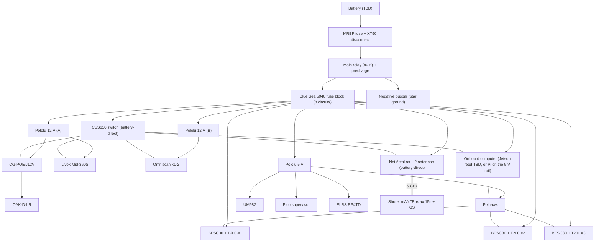
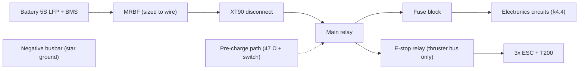

# ASKET 2.0 ASV — Capabilities, Compatibility and Integration
### Kelp Farm upgrade · NODE Engineering Club · Draft v0.2 · 2026-09-19 · revised after reading `node-ros-2026`

| | |
|---|---|
| **Companion document** | `KELP_MISSIONS.md` (what the boat does; network and cloud design) |
| **Inputs** | The BOM/tools sheet, `PROJECT_SCOPE_KELP_BLUE.pdf`, vendor datasheets, project notes, and the `node-ros-2026` repo (commit `f61b8a3`, 2026-08-06) |
| **What this is** | A **desk-check** compatibility test: datasheet-vs-datasheet and calculation. It is not a bench test. §5.7 turns every open item into a bench test with a pass criterion. |

---

## 0. Read this first

### 0.1 Tags and verdicts

| Tag | Meaning |
|---|---|
| **[SRC]** | From a vendor or primary document (URL in §7) or from the BOM itself |
| **[CALC]** | My arithmetic from sourced numbers |
| **[PROPOSAL]** | A design recommendation |
| **[OPEN]** | Needs a decision or a fact from the team |
| **[VERIFY]** | Believed correct but from a secondary source or memory; check before relying on it |

| Verdict | Meaning |
|---|---|
| **PASS** | Compatible as specified |
| **COND** | Compatible **if** the stated condition is met |
| **RISK** | Likely to cause a problem unless changed |
| **FAIL** | Will not work as specified |
| **UNKNOWN** | Not enough information to judge |

### 0.2 Limits of this document

- **`node-ros-2026` is now read** (public; commit `f61b8a3`, 2026-08-06). You said it mirrors `node-ros-namibia`, which is still unread. Code facts carry **[REPO: file:line]**; the old **[VERIFY-REPO]** tag is retired where the code settled the question. The repo is six weeks old, and the Pico 2 firmware and the ArduPilot parameter file are not in it.
- The Omniscan sonar, the battery, the onboard computer and log storage are **not in the BOM**.
- Several BOM items are custom or ambiguous (`Motherboard v1.3`, the Pico, the "BR Cerulean Integration Kit" row with no price).

### 0.3 Headline findings

1. **The battery decides everything and it is not chosen.** With Pololu 12 V regulators, a **4S LiFePO4 pack fails** (it sits below the regulator's usable input for most of the discharge). **5S LiFePO4 (16 V nominal, 12.5–18.25 V)** fits the regulators, the T200 window (7–20 V) and its 16 V design point (§4.2).
2. **A 12 V regulator is not 12.00 V.** Pololu's 12 V D42 regulator page specifies ±3% output accuracy (stated for the D42V55F12; check the D42V110F12 sheet) → **11.64–12.36 V**. The NetMetal and the CSS610 are specified from 12 V. Feed those two from the fused battery bus, not the regulator (§4.3 P7).
3. **The CG-POEiJ12V is "12 V only"** (steps 12 V up to 48 V). Keep it on a regulated rail and bench-test the tolerance.
4. **The onboard computer is undecided, and neither candidate has a power path in the BOM.** Your notes say Jetson AGX Orin; the repo deploys to a Raspberry Pi + BlueOS (§0.5). A Jetson has no ~19 V rail; a Pi would overload the 5 V rail that already feeds the Pixhawk. **[OPEN]**
5. **The 12 V relay coil is tapped upstream of the main relay**, so from battery voltage (up to about 18 V), not 12 V. Check the coil's continuous voltage limit or use a regulated coil supply (§4.3 P11).
6. **Thruster current is invisible.** The Basic ESC has no telemetry. Entanglement detection and honest energy accounting need an added current sensor.
7. **2.4 GHz Wi-Fi and the 2.4 GHz ELRS receiver will fight.** Disable 2.4 GHz on both MikroTik radios.
8. **The BOM has no sonar, no ELRS transmitter, no battery, no onboard computer or log storage, and one penetrator row that links to the wrong cable size** (§4.6).
9. **Batteries above 160 Wh cannot travel in passenger baggage** **[VERIFY: IATA/airline]**. Same for the aerosols and adhesives in the consumables list. Plan cargo shipping or local purchase now.

### 0.4 What reading the repo changed

The full table with file and line evidence is in `KELP_MISSIONS.md` §0.4. What matters for this document:

- **The compute platform is undecided** (§0.5). It changes P9, E1, S3, S8 and the power budget.
- **Three defects are confirmed** (C1 yaw feedback, C2 latched thrust, C9 leaked token) and **one safety layer is switched off** (C3). Patch and tests: §5.8, T15–T17.
- **The existing perception pipeline is the integration target** for the Livox and OAK-D-LR (§5.5), not a blank sheet.
- **A thruster-count mismatch** (two propellers in the repo, three T200 in the BOM) changes the current budget (P5, §4.4).

### 0.5 Platform fork: Jetson AGX Orin or Raspberry Pi + BlueOS

Your September notes say Jetson AGX Orin (`node2026`). The repo, at its last commit on 6 August, deploys to a Raspberry Pi (model not stated) running BlueOS 1.4.3 in Podman. The BOM lists neither. Both cases are carried below, and the Pi case is marked wherever it differs.

| Topic | Jetson AGX Orin | Raspberry Pi + BlueOS 1.4.3 **[REPO]** |
|---|---|---|
| Deploy path | **Not in the repo.** The `Containerfile` (ROS Jazzy, Ubuntu 24.04, arm64) should run. But `fcu_url: tcp://localhost:5777` is BlueOS's MAVLink router **[VERIFY]** and must become a serial or UDP URL; `pico_bridge` defaults to `/dev/ttyACM0`, which the Pixhawk's USB port may also claim (C6, C7); the image installs CPU-only ONNX Runtime | Works as written: `init.sh` installs Podman, BlueOS and two systemd services |
| Power | 15–60 W; needs its own supply (P9) | Pi 5 class draws up to about 5 A at 5 V **[VERIFY]**; would ride the 5 V rail (P9) |
| Hotel load | ≈97 W typical, ≈145 W peak (§4.4) | ≈65 W typical, ≈100 W peak **[CALC]** |
| Headroom for the Kelp sensors | High (GPU, more cores) | Tight. Nav2, fusion and CPU YOLO already run there; adding a 200 k pts/s Livox, OAK-D-LR, SonarView, MQTT and a recorder is a risk (S8). Mitigations: run the OAK's neural network on the camera; feed the Livox in as a 2D scan; or split the load across two computers |
| SonarView | Docker image; aarch64 build **[VERIFY]** | BlueOS extension, Cerulean's intended host **[SRC]** |
| Sealed-enclosure heat | RISK (E1) | COND (E1) |
| Log storage | Dev-kit M.2 slot **[VERIFY]**; no SSD in the BOM | microSD by default; no SSD in the BOM |
| Decision needed by | The ordering weeks (W3–W4) | Same |

---

## 1. System at a glance

### 1.1 Njord baseline → Kelp upgrade

| Function | Njord ASV (repo and team notes) | Kelp upgrade (this BOM) |
|---|---|---|
| Compute | Jetson AGX Orin (team notes, Sept) **or** Raspberry Pi + BlueOS 1.4.3 (repo deploy scripts, Aug); ROS 2 Jazzy in a container | The same computer carries over; the platform is an open decision (§0.5) |
| Flight control | Pixhawk + ArduPilot via MAVROS | Same |
| Autonomy | Nav2 (NavFn + Regulated Pure Pursuit) + BT.CPP `boat_bt` + `competition_manager`; Gazebo Harmonic simulation **[REPO]** | Same, extended with survey lanes, a keep-out layer, health and decision logging |
| Actuation | `actuator_driver` → MAVROS RC override (launched) or `pico_bridge` → Pico 2 (not launched); two propellers in the URDF **[REPO]** | 3 × T200 + 3 × BESC30 in the BOM **[OPEN: spare or third thruster]** |
| Positioning | Standard GPS; RTK GPS planned with Kartverket CPOS (Norway) | **UM982 dual-antenna RTK** + **own F9P base** (CPOS does not exist in Namibia) |
| Heading | Magnetometer/IMU | **Dual-antenna GNSS heading** (no magnetics) |
| Long-range comms | RFD900x + directional Wi-Fi (CPE210/NanoStation) planned | **MikroTik Wi-Fi 6 pair** (mANTBox ax 15s + NetMetal ax). RFD900x not in this BOM |
| Cellular | ESP32-WROVER-E + SIM7000G MQTT bridge (team notes; no MQTT code in the repo) | Kept as low-rate beacon; NetMetal also has a miniPCIe + NanoSIM slot |
| Perception | **RPLidar 2D** (12 m, 10 Hz) + USB camera (640×480) + YOLO26n-seg on CPU; calibrated intrinsics and LiDAR–camera extrinsic (2.51 px) **[REPO]** | Adds **OAK-D-LR** (stereo + RGB) and **Livox Mid-360S**; the existing pipeline is kept |
| Sonar | None | **Cerulean Omniscan 450 SS** (not in BOM) |
| Switching | GL.iNet mini router, USB Wi-Fi | **CSS610** managed switch, **PoE injector** for OAK |
| Power | Not described | Battery → MRBF → relay → **Blue Sea fuse block**, bucks, busbars |
| Safety | Software watchdog defeated by the PID timer; `collision_monitor` polygon disabled **[REPO]**; a Pico 2 gate exists in firmware that is not in the repo | Relay e-stop, pre-charge, fuses, Pico supervisor; repo patches in §5.8 |
| Cloud | HiveMQ/EMQX MQTT bridge + web GCS (in progress) | Same design, plus store-and-forward history |

### 1.2 Whole-system block diagram



---

## 2. Component register

**Status:** `EXISTING` (already on the Njord boat), `BOM` (in the sheet), `CLIENT` (partner-supplied), `MISSING` (needed, not listed).

### 2.1 Compute and control

| Component | Status | Key facts | Interface | Notes |
|---|---|---|---|---|
| Jetson AGX Orin | EXISTING | ROS 2 Jazzy; 15–60 W configurable **[SRC]** | 1× RJ45 (10 GbE class), USB, UART header | Power path **[OPEN]** |
| Raspberry Pi + BlueOS 1.4.3 | EXISTING **[REPO]** | Podman, `blueos.service` and `njord.service`, `--privileged --network host`; arm64 image built in CI; MAVROS via BlueOS's MAVLink router | USB, Ethernet, UART | Model **[OPEN]**; 5 V feed (P9) |
| Pixhawk (model **[OPEN]**) | EXISTING | ArduPilot; MAVROS | GPS1 (UM982), PWM out (3 ESCs), CRSF in | Confirm free ports |
| Motherboard v1.3 ×5 | BOM (custom) | €30 each | ? | Function **[OPEN]** |
| Pico 2 "safety rail" | EXISTING/BOM | RP2350 per the `pico_bridge` docstring; 5 V from D42V55F5; USB CDC 115200 (`/dev/ttyACM0`); accepts `L,R` (−1..1 → 1500 ± 500 µs), `MODE AUTO/MANUAL`; reports `STATE ...` every 250 ms; firmware **not in the repo** **[REPO]** | USB serial today (BOM plans to move Pixhawk and Pico off the USB hub) | Role and wiring **[OPEN]** (§5.3) |
| ESP32-WROVER-E + SIM7000G | EXISTING | Outbound MQTT bridge (dials the broker; avoids carrier NAT) | Cellular | Coverage **[OPEN]** |
| USB hub (keep existing) | EXISTING | New industrial hub is "Optional" | USB | Migrate Pixhawk/Pico to UART first |

### 2.2 Positioning

| Component | Status | Key facts | Interface | Notes |
|---|---|---|---|---|
| Holybro H-RTK UM982 | BOM €213.70 | Dual-antenna RTK GNSS; GPS-heading without a compass; built-in IST8310 compass | 10-pin JST-GH to Pixhawk GPS1; NMEA at 230400 baud **[SRC]** | Antennas ≥30 cm apart (ArduPilot) |
| GPS antenna mount (30°) | BOM | Sets antenna spacing | Mechanical | Measure the baseline precisely |
| Holybro H-RTK F9P Base | BOM €222.31 (Medium) | u-blox ZED-F9P; 5 V / 250 mA; survey-in ≤5 min ≈ 1.5 m CEP **[SRC]** | USB-C, UART2 | Outputs RTCM3 |

### 2.3 Perception

| Component | Status | Key facts | Interface | Power |
|---|---|---|---|---|
| RPLidar (existing) | EXISTING **[REPO]** | Serial 115200 on `/dev/ttyUSB0`; driver publishes 360 rays, 0.2–12 m, 10 Hz; model **[VERIFY]** (A1/A2 class) | USB | Not in the BOM; keep or replace? |
| USB camera (existing) | EXISTING **[REPO]** | OpenCV capture on `/dev/video0`, 640×480 BGR8; intrinsics fx 700.2, fy 696.5 | USB | Not in the BOM |
| OAK-D-LR | BOM €870.92 | 3× AR0234 2.3 MP global shutter, 5/10/15 cm baselines, depth to ~30 m, IP65, RVC2 4 TOPS **[SRC]** | RJ45 (PoE) or USB | ≤5.5 W **[SRC]**; BOM lists BNO085 IMU, Luxonis lists BNO086, check |
| Livox Mid-360S | BOM €785.94 (**Optional**) | 360° × 59° FOV, 200 k pts/s, IP67, ~40 m at 10% reflectivity; S variant lists a 100 m cut-off **[SRC]** | 100BASE-TX, static IP 192.168.1.1XX | 9–27 V, ~6.5 W typical |

### 2.4 Sonar

| Component | Status | Key facts | Interface | Power |
|---|---|---|---|---|
| Omniscan 450 SS | **CLIENT?/MISSING** | 450 kHz, 0.5° × 50°, 150 m max, 20 pps at ≤30 m, 300 m depth **[SRC]** | 100BASE-T; 4-pin JST-GH (with RJ45 adapter); transducer wires to the board | 10–30 V; 5 W idle, 10 W pinging |
| SonarView | Software | Docker image; web UI on 7077; NMEA in over UDP/serial; SonarLink WebSocket | Ethernet | — |
| BR Cerulean Integration Kit | BOM (no price) | Bracket geometry reference | Mechanical | — |
| WetLink penetrators (sonar cables ×3, M10) | BOM | Sonar transducer cables | Mechanical | See §4.6: check the variant |

### 2.5 Communications

| Component | Status | Key facts | Interface | Power |
|---|---|---|---|---|
| MikroTik mANTBox ax 15s (shore) | BOM €156 | 15 dBi (5 GHz), 120° sector, Wi-Fi 6, RouterOS v7; comes with PoE injector | GbE (passive PoE in), SFP | 12–28 V DC or 18–28 V passive PoE; ≤21 W **[SRC]** |
| MikroTik NetMetal ax (boat) | BOM €158.50 | IPQ-5010 + QCN6102, IP66; 1× GbE, 1× SFP (2.5G), miniPCIe + NanoSIM, USB, 2× RP-SMA; TX 28 dBm (MCS0) to 20 dBm (MCS11); RX −96 to −67 dBm **[SRC]** | GbE | 12–28 V DC; 12 W idle, 25 W max |
| HGO-antenna-OUT ×2 | BOM | Dual-band omni; datasheet 6.7 dBi at 5 GHz (retailers list 5.5–7.1); RP-SMA male **[SRC]** | RP-SMA | — |
| Antenna extensions ×2 | BOM | 1 m LMR-240, RP-SMA male ↔ female | — | — |
| CSS610-8G-2S+IN | BOM €113.67 | 8× GbE + 2× SFP+, passive cooling, SwOS **[SRC: BOM]** | RJ45 | 12–57 V, 5–11 W |
| CG-POEiJ12V | BOM €107.56 | Active 802.3af/at injector, 12 V input only, 15.4 W (Type 1) / 34.2 W (Type 2), 0–55 °C **[SRC]** | RJ45 in/out | 12 V, ≤3 A |
| RadioMaster RP4TD | BOM €29.99 | ELRS 2.4 GHz, true diversity, CRSF | UART | 5 V |
| IP68 RJ45 panel bulkhead | BOM | External Ethernet service port | RJ45 | — |
| Ethernet cables | BOM | S/FTP Cat6: 25 cm ×10, 50 cm ×5, 1 m ×3, 2 m ×1, 5 m ×1 | — | — |
| **ELRS transmitter/handset** | **MISSING** | Needed to bind the RP4TD | — | — |

### 2.6 Propulsion, power and protection

| Component | Status | Key facts | Notes |
|---|---|---|---|
| Blue Robotics T200 ×3 | BOM €590.58 | 7–20 V; designed for best performance at 16 V; ~24 A at full throttle at 16 V **[SRC]**; 76 mm propeller | ~30 A near 20 V |
| BESC30-R3 ×3 | BOM €102.72 | 7–26 V, 30 A constant (cooling-dependent); PWM 1100–1900 µs, up to 400 Hz; **no telemetry** **[SRC]** | Signal 3.3–5 V |
| Pololu D42V110F12 ×2 | BOM | 12 V; 9 A typical at 42 V in; input 12–60 V subject to dropout; output current limited by thermal dissipation **[SRC]** | Sensor rails |
| Pololu D42V55F5 ×1 | BOM | 5 V, 6 A typical; input 5–60 V **[SRC]** | Pico/safety/Pixhawk rail |
| Blue Sea 5046 fuse block | BOM €74.48 | 8 circuits, 100 A bus, 30 A per circuit **[SRC: BOM]** | Zero spare circuits |
| Negative busbar (10-gang) | BOM | Star ground | — |
| CIT A3K relay ×2 | BOM | 80 A, blow-out magnet, 12 V coil 1.6 W, SPST-NO | Main + e-stop |
| Pre-charge resistor | BOM | 47 Ω, 10 W, aluminium-housed | Needs a switching path (§5.3) |
| MRBF fuse + holder | BOM, **size TBD** | ~10 kA interrupt, on the battery terminal | Sized after the battery |
| XT90/Anderson ×2 | BOM, **TBD** | Storage/freight disconnect | — |
| TVS diodes, bulk capacitors | BOM, **no values** | Input protection on each buck and the NetMetal jack | Values needed |
| **Battery + BMS** | **MISSING** | — | §4.2 |
| Ground-station battery | BOM "Optional" | For GS and laptop on the lighthouse | See §4.6: not optional without mains |

### 2.7 Enclosure and marine

Spare O-rings, WetLink penetrators and tools, pressure-equalisation vents (+ backing nuts), vacuum test pump and terminal, cable glands, desiccant, conformal coating (motherboard and BMS), dielectric grease, VCI capsules/bags, marine epoxy, self-amalgamating and butyl tape. Sound practice; nothing here conflicts.

---

## 3. Superpowers

What the upgrade enables that the Njord boat could not do. Numbers are **[CALC]** from sourced specs unless noted.

| # | Superpower | Enabled by | What it unlocks | Caveat |
|---|---|---|---|---|
| 1 | **Compass-free, georeferenced sonar mosaics** | UM982 dual antenna + RTK base + SonarView | ~0.17° heading (≈9 cm smear at 30 m) vs 3° for a typical compass (≈1.6 m) | Vendor accuracy claim to be **[VERIFY]**; antennas ≥30 cm apart |
| 2 | **Centimetre-class RTK at the site** | F9P base at the lighthouse → RTCM → UM982 | Repeatable lines; change detection between visits (M5) | Base survey-in gives relative, not absolute, accuracy |
| 3 | **360° obstacle sense + stereo + colour** | Livox (~40 m at 10% reflectivity) + OAK-D-LR (~30 m stereo) | Two independent modalities; canopy can be recognised by colour | Water is hard for both; test on the water |
| 4 | **Broadband link, Wi-Fi 6, dual-chain** | mANTBox 15 dBi + NetMetal + 2 antennas | Live SonarView UI, telemetry, RTCM and backfill over one link; **+9.5 dB margin at MCS7 at 1.3 km** | Sea-surface fading; keep rate low |
| 5 | **Black box + live copy + cloud history** | Local SSD logs, MQTT, store-and-forward | Nothing is lost if the link or uplink drops | Uplink is **[OPEN]** (not Starlink) |
| 6 | **Hardware safety chain** | Main relay, e-stop relay, fuses, pre-charge, Pico | Kill thrusters without depending on ROS | Pre-charge sequencing to be finished (§5.3); the software watchdog is currently defeated (§5.8) |
| 7 | **Field serviceability** | Tool kit, spares, vacuum test pump, VCI, epoxy | Repair and re-seal at the site | Air-freight rules for consumables |
| 8 | **Explainable autonomy** | Decision-log design (software) | "Why did it stop?" answered on screen | New code |
| 9 | **A measured power budget** | DC clamp meter (BOM) + per-rail sensing | Battery sized from data, not guesses | Add thruster-current sensing |

**Which sensor covers which hazard (redundancy view):**

| Hazard | Livox | OAK-D-LR RGB | OAK-D-LR stereo | Sonar | GNSS/chart |
|---|---|---|---|---|---|
| Buoy at water level | Yes | Yes | Yes (solid) | — | Chart |
| Kelp canopy | Partial (surface) | **Yes** (colour) | Weak | — | Farm polygon |
| Moving vessel | Yes | Yes | Yes | — | — |
| Shoreline/rocks | Yes | Yes | Yes | Depth | Chart |
| Subsurface structure | — | — | — | **Yes** | Farm polygon |

**What you can tell the client [PROPOSAL]:**

| Scope bullet | Capability | Evidence artefact |
|---|---|---|
| Travel to 1.3 km | Link budget + range walk | M1 link-vs-distance table |
| Flag obstacles and drift | Perception + M6 | Alert log |
| Show how the stack is thinking | Decision log | GUI "why" panel + log |
| Report own health | Telemetry + hull sensors | Health dashboard |
| Sonar quality | QC metrics + M4 | Detection table + QC report |

---

## 4. Compatibility test (desk check)

### 4.1 Method

Each item compares two datasheets (or a datasheet and a use case), states a verdict, and gives the action that closes it. IDs are stable so §5.7 bench tests can point back at them.

### 4.2 Battery vs. the rest of the system

**Constraints [SRC + CALC]:** 12 V regulators need input above 12 V plus dropout (I plan on **≥13.5 V loaded**; **[VERIFY]** against the Pololu dropout curve). T200 rated 7–20 V. BESC30 7–26 V. NetMetal 12–28 V. Blue Robotics states the T200 is designed to run best at 16 V and rated to 20 V.

| Pack | Usable window | Regulators | T200 | Verdict |
|---|---|---|---|---|
| 4S LiFePO4 | 10.0–14.6 V (12.8 nominal) | Below 13.5 V for most of the discharge | Works, low thrust | **FAIL** |
| 4S Li-ion (NMC) | 12–16.8 V | Only above ~13.5 V; bottom ~30% of capacity is unusable | OK | **COND** |
| **5S LiFePO4** | **12.5–18.25 V (16 nominal; use ~15–18)** | Yes | **Yes, at its 16 V design point** | **PASS (recommended)** |
| 5S Li-ion (NMC) | 15–21 V | Yes | Above 20 V rating when full | FAIL unless capped at ~4.0 V/cell |
| 6S (any) | 18–25.2 V | Yes | Exceeds 20 V | **FAIL** |

Two consequences:

- **LiFePO4 has a very flat voltage curve.** State of charge cannot be read from voltage. You need current integration (a shunt or BMS reporting) to give the dashboard an honest battery percentage. This is **[PROPOSAL]** and also feeds the return-energy calculation.
- **Energy sizing [CALC, replace with clamp-meter data]:**

| Average power | 2 h mission energy | Ah at 16 V |
|---|---|---|
| 150 W | 300 Wh | 19 Ah |
| 250 W | 500 Wh | 31 Ah |
| 350 W | 700 Wh | 44 Ah |

A 5S LiFePO4 of roughly **35–40 Ah (≈560–640 Wh)** is a reasonable first target for ~2 h with reserve, assuming hotel load of ~100 W (Jetson case; about 65 W with a Pi, §4.4) plus propulsion of 100–250 W. Propulsion draw is the unknown. Measure it with the clamp meter in Barcelona.

### 4.3 Compatibility matrix

#### Power and protection

| ID | Subject | Verdict | Finding | Action |
|---|---|---|---|---|
| P1 | Battery ↔ 12 V regulators | **FAIL / COND / PASS** by chemistry | See §4.2 | Choose 5S LiFePO4 |
| P2 | Battery ↔ T200 window | **PASS** for 5S LFP | 18.25 V full charge < 20 V | Set charger limit; avoid 6S |
| P3 | T200 ↔ BESC30 | **COND** | ~24 A at 16 V vs 30 A constant (cooling-dependent). Near 20 V the T200 is ~30 A, at the ESC's limit | Keep ≤18 V; cap max throttle (~90%); heatsink to the hull |
| P4 | BESC feed ↔ 30 A circuit fuse | **COND** | Blade fuses run hot near rating; sustained full throttle at 17–18 V will approach 27 A | Software throttle cap; pick fuses by continuous-current curve |
| P5 | Peak system current ↔ fuse block and wire | **COND** | 3 × 24 A + ~9 A hotel ≈ **81 A** peak vs a 100 A bus (OK); about 57 A if only two thrusters are live (the repo has two, C5). But 8 AWG battery trunk (BOM) is marginal for 80–100 A **[VERIFY ampacity]**; an MRBF at 100 A would not protect 8 AWG | Use 6 AWG trunk or cap total thruster current in software; size MRBF to the wire, not the bus |
| P6 | 12 V regulators ↔ load | **PASS** | 12V-A ≈ 1.2 A, 12V-B ≈ 1.7 A vs ~9 A capacity (§4.4) | — |
| P7 | 12 V accuracy ↔ devices specified from 12 V | **RISK** | ±3% → as low as **11.64 V**; NetMetal is 12–28 V; CSS610 12–57 V | Feed NetMetal and CSS610 **battery-direct** (post-fuse, with TVS + LC filter), as the BOM's TVS/bulk-cap lines already imply |
| P8 | CG-POEiJ12V input tolerance | **UNKNOWN** | "12 V DC" with no stated tolerance; Type 1 output 15.4 W vs OAK ≤5.5 W is fine | Bench-test at 11.6 V and 12.4 V; fuse its input; watch reverse polarity (vendor warns of damage) |
| P9 | Compute power path | **UNKNOWN** | Jetson: no ~19 V (or similar) rail in the BOM; dev-kit adapters are ~19–20 V class **[VERIFY]**, which a buck-only 12 V rail cannot supply. Pi: the 5 V rail (D42V55F5, 6 A typical) already feeds Pixhawk, UM982, Pico, ELRS and ESP32 (about 1.2 A typical, 1.6 A peak **[CALC from §4.4]**); a Pi 5 class board can add up to about 5 A **[VERIFY]**, which is more than the rail has left | **[OPEN]** Decide the platform (§0.5). Jetson: boost/buck-boost to ~19 V, USB-C PD, or a module carrier on a native input. Pi: a dedicated 5 V ≥ 5 A buck so a Pi brown-out cannot reset the Pixhawk |
| P10 | Pre-charge resistor | **COND** | 47 Ω: inrush ≤0.34 A at 16 V; 2 mF → 5τ ≈ 0.47 s; energy ≈ 0.26 J; peak dissipation ≈ 5.4 W (< 10 W) **[CALC]**. But the BOM has no element that bypasses or sequences it | Add a small pre-charge relay or MOSFET path (§5.3) |
| P11 | Relay coil supply | **RISK** | 12 V, 1.6 W coil tapped upstream of the main relay = **battery voltage** (up to ~18 V). At 16 V a resistive coil dissipates ~2.8 W **[CALC]** | Check the A3K coil's continuous voltage limit **[VERIFY]**; else use a series dropper or a small always-on 12 V regulator for the coil |
| P12 | Livox (9–27 V), Omniscan (10–30 V) | **PASS** | Both fine on 12 V or battery | — |
| P13 | TVS and bulk capacitors | **OPEN** | No values in the BOM | TVS standoff ≥ ~1.1 × max pack voltage (≈20 V) with clamp below the downstream limit **[PROPOSAL]**; size caps to ripple/hold-up |
| P14 | Thruster current visibility | **GAP** | BESC30 has no telemetry | Add per-branch current sensing (INA228-class shunt, Hall sensor) on the ESC feeds |
| P15 | ESC signal ↔ Pixhawk | **PASS** | 3.3–5 V logic, 1100–1900 µs, ≤400 Hz; 1500 µs = stop | Calibrate 1100/1900 in ArduPilot |

#### Data and network

| ID | Subject | Verdict | Finding | Action |
|---|---|---|---|---|
| D1 | CSS610 ports | **PASS** | Onboard computer, NetMetal, OAK (injector data), Livox, Omniscan ×2, service bulkhead = 7 of 8 | Keep one spare; SFP+ unused |
| D2 | Default IP collisions | **COND** | Livox 192.168.1.1xx, Omniscan 192.168.2.92, MikroTik 192.168.88.1 | Re-address to one plan (Missions §6.4) |
| D3 | OAK-D-LR PoE ↔ injector | **PASS** | Type 1 injector 15.4 W vs ≤5.5 W load | Static IP for the camera; use S/FTP cable |
| D4 | Omniscan ↔ switch | **PASS** | 100BASE-T into a GbE port auto-negotiates; JST-GH ↔ RJ45 adapter supplied | Keep enclosure cabling short and shielded |
| D5 | Sonar discovery over Wi-Fi | **COND** | SonarView discovery uses broadcast, which Wi-Fi normally blocks | Run SonarView on the boat; use only its web UI remotely |
| D6 | UM982 ↔ Pixhawk | **PASS** | 10-pin JST-GH to GPS1; NMEA 230400 baud | Confirm the Pixhawk model's GPS port and ArduPilot version support **[VERIFY]** |
| D7 | F9P base RTCM → UM982 | **PASS** | Standard RTCM3; both dual-frequency | Route via UDP → MAVLink `GPS_RTCM_DATA` or direct serial |
| D8 | Pixhawk ↔ onboard computer | **PASS** | Move from the USB hub to UART (BOM already says so). On the Pi path the Pixhawk is reached through BlueOS's MAVLink router, not directly **[REPO]** | Same for the Pico; see C6, C7 for the device-name and URL changes on a new computer |
| D9 | RP4TD ↔ Pixhawk | **PASS** | CRSF over UART | Needs a transmitter (missing) |
| D10 | Livox ↔ onboard computer | **PASS (hardware)** | 100BASE-TX UDP | Software risk in S2 |
| D11 | Sonar timestamps | **OPEN** | `timestamp_ms` is since sonar power-up, not UTC | Define the clock-offset method (Missions §5.5) |
| D12 | Livox time sync | **COND** | PTP through a non-PTP-aware SwOS switch is best-effort | Direct link, or accept ms-level error |

#### RF

| ID | Subject | Verdict | Finding | Action |
|---|---|---|---|---|
| R1 | 5 GHz link at 1.3 km | **COND** | +9.5 dB at MCS7; +2.5 dB at MCS9; MCS11 negative **[CALC]**. Sea-reflection fading can swing ±6 dB or more | Cap the MCS; raise the shore antenna; use both chains; measure in M1 |
| R2 | Wi-Fi 2.4 GHz ↔ ELRS 2.4 GHz | **RISK** | NetMetal 2.4 GHz TX 22–29 dBm within centimetres of the RC receiver | Disable 2.4 GHz on both MikroTik units |
| R3 | Antenna connectors | **PASS** | HGO has RP-SMA male; radio port RP-SMA female; extension is male ↔ female | Verify gender on delivery; 50 Ω throughout |
| R4 | GNSS L-band vs digital noise | **COND** | PoE Ethernet for the OAK avoids USB 3 emissions near GNSS. Livox, the computer, CSS610 and regulators still radiate | Antennas on the mast, ≥0.5 m from Wi-Fi antennas and from the Livox; ferrites; shielded cable |
| R5 | Sector antenna pointing | **COND** | mANTBox is a 120° sector; the farm must sit inside it | Site survey at the lighthouse; adjust pan/tilt |
| R6 | Regulatory (5 GHz and 2.4 GHz) | **UNKNOWN** | Namibian rules and RouterOS country profile not checked | **[OPEN]** |
| R7 | Mast layout | **COND** | Wi-Fi antennas vertical, unshadowed; UM982 antennas ≥30 cm apart; Livox not blocking anything | Draw a mast layout before fabricating |

#### Software (ROS 2 Jazzy on the onboard computer)

| ID | Subject | Verdict | Finding | Action |
|---|---|---|---|---|
| S1 | depthai-ros | **PASS** | Released for Jazzy (Dec 2025); DepthAI v3 packages exist for Jazzy **[SRC]** | Use the Jazzy release; RVC2 (OAK-D-LR) supported |
| S2 | livox_ros_driver2 | **RISK** | Upstream documents Foxy and Humble (Ubuntu 22.04); Jazzy is not listed. The Mid-360S is a newer variant **[SRC]**. The repo image is ROS Jazzy on Ubuntu 24.04 | Build from source inside the same `Containerfile`; CI builds arm64 under QEMU, so expect a slower build; confirm the SDK supports the S variant **[VERIFY]** |
| S3 | SonarView on the chosen computer | **COND** | Cerulean's intended hosts are a desktop or a BlueOS extension **[SRC]**, so the Pi path is native. Jetson path: Docker image exists; arm64 tag not confirmed by me | Pull and run on the chosen computer in Phase A **[VERIFY]** |
| S4 | MAVROS | **PASS** | Already in the Njord stack | — |
| S5 | foxglove_bridge | **PASS** | Jazzy listed in the ROS index | Same-LAN use only |
| S6 | ROS 2 DDS over the radio | **RISK** | Multicast discovery over Wi-Fi is fragile | Do not cross the link with DDS; use MQTT/WS (Missions §6.4) |
| S7 | rosbag2 MCAP | **PASS** | MCAP is the default storage since Iron | Rotate files; zstd |
| S8 | Onboard CPU/GPU budget | **UNKNOWN** (Jetson) / RISK (Pi) | The existing stack already runs Nav2, fusion and CPU YOLO (`onnxruntime` is CPU-only in the `Containerfile`) **[REPO]**; the Kelp upgrade adds Livox, OAK, SonarView, recorder and MQTT on the same box | Measure with `tegrastats` or `top` under full load (T18); run the OAK's NN on the camera; feed the Livox as a 2D scan |

#### Environmental and mechanical

| ID | Subject | Verdict | Finding | Action |
|---|---|---|---|---|
| E1 | Computer in a sealed enclosure | **RISK** (Jetson) / COND (Pi) | Jetson 40–60 W with no airflow; a Pi is roughly a fifth of that **[VERIFY]**. The PoE injector is rated to 55 °C | Conduct heat to the hull/plate; thermal soak test; temperature telemetry |
| E2 | Vent ↔ vacuum test | **COND** | Equalisation vents must be closed for a vacuum test | Written procedure: plug → test → unplug → log |
| E3 | IP ratings | **PASS** | NetMetal IP66, OAK-D-LR IP65, Livox IP67, sonar transducers 300 m | Enclosure and penetrator quality dominate |
| E4 | Livox inverted mount | **PASS** | Inverted = 52° below, 7° above horizon | Flip the extrinsic (roll 180°); IMU axes flip too |
| E5 | Transducer tilt | **COND** | Fixed tilt may miss the 5–10 m grid depth (Missions §2.M3 table) | Adjustable brackets (~15°–45°) |
| E6 | Kelp and propellers | **RISK** | Mature canopy at the surface; 76 mm props | Keep-out canopy layer; entanglement detection; guard/design review |
| E7 | Galvanic/corrosion | **PASS** | Stainless hardware, anti-seize, VCI, dielectric grease | Rinse/inspect routine |

#### Code and deployment (from the repo)

| ID | Subject | Verdict | Finding | Action |
|---|---|---|---|---|
| C1 | `pid_controller` IMU topic | **FAIL** | `pid_controller.py:46` subscribes to `/imu/data`; nothing publishes it (`imu_gps_driver` publishes `/imu_driver/imu_raw`). Yaw rate stays 0 and the stale-IMU check never fires, because it only runs after a first message **[REPO]** | Change the topic; warn when no IMU has ever arrived (§5.8); T16 |
| C2 | Command watchdog | **FAIL** | `pid_controller` publishes `/control/effort` at 20 Hz from a timer (`:48`) and `_sp_cb` (`:61-63`) never expires the setpoint. If Nav2, `twist_mux` or `boat_bt` die, the last thrust stays latched, and neither `pico_bridge`'s 0.3 s `cmd_timeout` nor ArduPilot's RC-override lapse can fire, because fresh messages keep arriving **[REPO]** | Setpoint timeout in `pid_controller`; neutral-on-silence in `actuator_driver` (§5.8); T15 |
| C3 | Nav2 `collision_monitor` | **RISK** | `FootprintApproach` is `enabled: false` (`nav2_params.yaml:207`); the scan source is enabled (`:217`). There is no Nav2-level reflex stop today **[REPO]** | Choose stop and slow polygons after the `d_stop` test; enable; T17 |
| C4 | Two actuation paths | **OPEN** | `actuator_driver` (RC override) is launched; `pico_bridge` exists but is not in `njord.launch.py` **[REPO]** | Decide which is wired; put the choice behind a launch argument; M0 tests |
| C5 | Thruster count vs mixer | **OPEN** | The URDF has left and right propellers and `_mix` is a two-output skid-steer mixer; the BOM has three T200 and three BESC30 **[REPO]** | Spare or a third thruster? If a third, the mixer, the ESC mapping and the frame type are new work |
| C6 | MAVROS link | **COND** | `fcu_url: tcp://localhost:5777` is BlueOS's MAVLink router endpoint **[VERIFY]**; `gcs_url` is `udp://@localhost:14556` **[REPO]** | On a computer without BlueOS, use a serial or UDP `fcu_url` behind a launch argument |
| C7 | USB device names | **COND** | `pico_bridge` uses `/dev/ttyACM0`, `lidar_driver` uses `/dev/ttyUSB0`; the only udev rule matches CP210x (`10c4:ea60`) **[REPO]** | udev symlinks by ID or path for Pixhawk, Pico and RPLidar |
| C8 | Container and CI | **COND** | The arm64 image is built under QEMU in GitHub Actions; the container runs `--privileged --network host --ipc host --pid host`; `foxglove_bridge` listens on 8765 with no authentication **[REPO]** | Fine on a bench. On the boat, bind or firewall Foxglove to the boat LAN; expect longer CI builds once the Livox SDK is added |
| C9 | Secrets in a public repo | **FAIL** | `scripts/init.sh:10` contains a GitHub personal access token in plain text; `deploy-pi.sh` passes the password on the `sshpass` command line with host-key checking off **[REPO]** | **Revoke the token now** (history rewrite does not un-leak it); pass secrets by environment or a credential store; use SSH keys |
| C10 | Sensor geometry | **RISK** | URDF sensor heights do not match the hardware (LiDAR plane 52.5 mm vs 174.8 mm; camera 24.5 mm vs 137.3 mm); LiDAR–camera alignment is not yet checked in RViz2 **[REPO: `TODOS.md`]** | Fix the URDF and verify; define `base_link` lever arms for GNSS and sonar (§5.4) |
| C11 | Perception range and depth | **COND** | RPLidar reaches 12 m at 10 Hz; YOLO runs on CPU; `fusion_node` places YOLO-only detections at a fixed 5 m **[REPO: `TODOS.md`]** | Feed the Livox and OAK-D-LR in (§5.5); measure `d_stop` (Missions M2) |
| C12 | Survey speed vs Nav2 | **COND** | Regulated Pure Pursuit `desired_linear_vel: 1.0`, lookahead 2 m; 0.5 m goal tolerance **[REPO]** | Set per Missions M3; measure cross-track error |
| C13 | Frame type | **OPEN** | `FRAME_TYPE` on the Pixhawk is unconfirmed and RPP `rotate_to_heading` is enabled **[REPO: `TODOS.md`]** | Confirm in QGroundControl before any water test |

### 4.4 Power budget and circuit allocation **[PROPOSAL]**

| Load | Feed | Typical W | Peak W | Basis |
|---|---|---|---|---|
| Jetson AGX Orin | Dedicated feed **[OPEN]** | 40 | 60 | 15–60 W range; workload dependent, measure |
| NetMetal ax | Battery-direct | 15 | 25 | 12 W idle, 25 W max **[SRC]** |
| CSS610 | Battery-direct | 8 | 11 | BOM 5–11 W |
| OAK-D-LR + injector loss | 12V-A | 7 | 9 | ≤5.5 W + converter loss |
| Livox Mid-360S | 12V-A | 6.5 | 12 | 6.5 W typical; peak allowance is my estimate |
| Omniscan ×2 | 12V-B | 15 | 20 | 5 W idle / 10 W pinging each |
| Pixhawk + UM982 + Pico + ELRS + ESP32 | 5 V | 6 | 8 | Estimate |
| **Hotel total** | | **≈97 W** | **≈145 W** | |

At 16 V that is about **6 A typical, 9 A peak** of hotel current, plus up to **72 A** from three T200 thrusters at full throttle (48 A if only two are live) **[CALC]**.

**If the computer is a Pi [CALC]:** replace the Jetson line with about 8 W typical and 15 W peak **[VERIFY]**. Hotel load becomes about **65 W typical and 100 W peak**, or about 4 A typical and 6 A peak at 16 V. The Pi rides the 5 V rail, so circuit 8 is freed, but the 5 V rail itself needs strengthening (P9).

**Blue Sea 5046 allocation (8 circuits, none spare):**

| Ckt | Load | Fuse |
|---|---|---|
| 1–3 | Thruster/ESC ×3 (circuit 3 is free if only two thrusters are live, **[OPEN]**) | 30 A blade (see P3/P4) |
| 4 | 12V-A regulator (OAK injector, Livox) | 5 A |
| 5 | 12V-B regulator (Omniscans) | 5 A |
| 6 | 5 V regulator | 3 A |
| 7 | Battery-direct network (NetMetal + CSS610) via TVS + LC | 7.5 A |
| 8 | Jetson feed **[OPEN]** (free in the Pi case) | 10 A |

If you need a spare circuit, add a small second fuse block for the electronics and leave the Blue Sea for thrusters plus main electronics feed.

### 4.5 Scorecard and top actions

62 desk checks were run. Counts are taken from the §4.3 matrix **[CALC]**; a composite verdict is counted under its first (Jetson-case) value, and P1 is counted separately because its verdict depends on the chemistry chosen.

| Domain | PASS | COND | RISK | FAIL | UNKNOWN | OPEN / GAP | By chemistry | Total |
|---|---|---|---|---|---|---|---|---|
| Power and protection (P) | 4 | 4 | 2 | 0 | 2 | 2 | 1 | 15 |
| Data and network (D) | 8 | 3 | 0 | 0 | 0 | 1 | 0 | 12 |
| RF (R) | 1 | 4 | 1 | 0 | 1 | 0 | 0 | 7 |
| Software (S) | 4 | 1 | 2 | 0 | 1 | 0 | 0 | 8 |
| Environmental / mechanical (E) | 3 | 2 | 2 | 0 | 0 | 0 | 0 | 7 |
| Code and deployment (C) | 0 | 5 | 2 | 3 | 0 | 3 | 0 | 13 |
| **Total** | **20** | **19** | **9** | **3** | **4** | **6** | **1** | **62** |

**How to read it:**

- **Hard FAILs are code and process, not hardware pairs:** C1 (`pid_controller` IMU topic); C2 (Command watchdog); C9 (Secrets in a public repo). No component pair fails if the battery is 5S LiFePO4; the only hardware FAIL is the 4S LiFePO4 option inside P1.
- **Data and network is still the healthiest domain.** The Ethernet-based sensing was a good call: the switch has spare ports and the OAK, Livox and sonar all sit on it.
- **Power is where the open hardware work is.** P7 and P11 are RISK, P8 and P9 are UNKNOWN, P13 and P14 are open or gaps, and P1 depends on the chemistry.
- **The 9 RISK items** are P7 (12 V accuracy ↔ devices specified from 12 V); P11 (Relay coil supply); R2 (Wi-Fi 2.4 GHz ↔ ELRS 2.4 GHz); S2 (livox_ros_driver2); S6 (ROS 2 DDS over the radio); E1 (Computer in a sealed enclosure); E6 (Kelp and propellers); C3 (Nav2 `collision_monitor`); C10 (Sensor geometry). Each has a concrete action in the matrix.
- **The 4 UNKNOWN items** (P8, P9, R6, S8) can each be closed with a datasheet check, a bench test or a call to the supplier.
- **The 6 open or gap items** (P13, D11, C4, C5, C13, P14) need a decision from the team rather than a test.

The 19 COND items are workable as designed but need a parameter, a bracket, a cap or a procedure before they are safe.

**Top actions, in order [PROPOSAL]:**

1. **Revoke the GitHub token** in `scripts/init.sh` (C9). Today.
2. **Patch the control chain** (C1, C2; §5.8) and pass T15 and T16 before any thruster runs under autonomy.
3. **Decide the onboard computer** (§0.5) and, with it, its power path (P9).
4. Choose the battery (**5S LiFePO4**), with a BMS that reports current. Start air-freight or local-sourcing planning today.
5. Add **thruster-current sensing**.
6. **Disable 2.4 GHz** on both MikroTik units; buy an ELRS transmitter.
7. Move NetMetal and CSS610 **battery-direct**; bench the injector at 11.6 V and 12.4 V.
8. Resolve the **relay coil supply** and **pre-charge sequencing**.
9. Confirm the **sonar** (model, quantity, delivery, third penetrator) and the **thruster count and wiring** (C4, C5).
10. Fix the **penetrator link** in the BOM.
11. Measure `d_stop`, then enable and tune the `collision_monitor` polygon (C3, T17).
12. Re-address the network; run SonarView and the Livox driver on the chosen computer.
13. Size the MRBF and battery trunk to the **wire**, not the fuse block.

### 4.6 BOM audit

| Finding | Detail | Action |
|---|---|---|
| **Sonar missing** | No Omniscan line; only bracket reference and three sonar-cable penetrators | Confirm supply and model |
| **Battery missing** | MRBF and XT90 are "added later once battery is settled" | §4.2 |
| **ELRS transmitter missing** | RP4TD is a receiver | Buy or borrow |
| **Penetrator variant** | The "Sonar transducer cables M10-5.5mm" row links to the **6.5 mm** WetLink variant (the same URL as the thruster row) | Recheck the link before ordering |
| **Third penetrator** | Three sonar penetrators vs. two SS transducers | Explain or reduce |
| **Priorities out of line with dependencies** | Livox "Optional" but collision avoidance depends on it; RTK base "Medium" but underpins survey quality; GS battery "Optional" but needed without guaranteed mains | Re-rank |
| **Unpriced lines** | Battery, MRBF, XT90 ×2, TVS, bulk caps, BR kit, GS battery, buoyancy foam, guy lines | The €5,960.20 grand total is therefore incomplete |
| **Arithmetic** | Subtotals sum correctly (1,166.45 + 489.37 + 4,304.38 = 5,960.20) | — |
| **Price gap** | OAK-D-LR is €870.92 (Mouser) vs. a lower Luxonis list price | Re-check source and stock |
| **Odd row** | `vacuum test terminal` quantity/price sit in shifted columns | Tidy the sheet |
| **Mains and power at the lighthouse** | Type D/M adapters and a cable drum imply mains; GS battery "Optional" | Confirm |
| **Air-freight** | WD-40, isopropyl alcohol, threadlocker, conformal coating, epoxy, and any battery | **[VERIFY]** IATA/airline rules; ship or buy locally |
| **Cellular module** | miniPCIe + NanoSIM slot on the NetMetal is unused | Optional LTE fallback if there is coverage |
| **Compute platform missing** | No Jetson or Pi line, so the power path cannot be derived from the BOM | Add the chosen computer, its supply and its storage (§0.5) |
| **Log storage missing** | No SSD or NVMe line, but the design logs at full rate onboard | Add one; avoid microSD for logs |
| **Existing sensors not listed** | The RPLidar and the USB camera are in the repo's drivers but not in the BOM, and the existing pipeline depends on them | Decide keep or replace |
| **Pico 2** | The repo docstring says Pico 2; the BOM says "Pico" | Confirm the model and where its firmware lives |

---

## 5. Integration with the current system

### 5.1 What carries over, changes, is new

| Carries over | Changes | New |
|---|---|---|
| ROS 2 Jazzy container, MAVROS, ArduPilot, Nav2 + `boat_bt` + `mission_manager`, calibration tooling | GNSS source and heading (UM982); `fcu_url` and device names if the computer changes (C6, C7) | Livox and OAK-D-LR drivers, wired in through existing topics (§5.5) |
| ESP32 + SIM7000G MQTT bridge (outbound dial) | Radio link (MikroTik pair replaces RFD900x/CPE210 plans; confirm intent) | SonarView, `sonar_bridge`, `nmea_udp_bridge` |
| MQTT-over-WebSocket GCS (Leaflet, Chart.js) | RTK source (own F9P base; no NTRIP in Namibia) | Decision log, health monitor |
| Hostname-based access to the onboard computer | Power system (battery, fuse block, relays) | Store-and-forward layer and cloud stack |
| Publish-rate throttling to the GUI (5–10 Hz) | Network addressing (routed subnets) | Farm GeoJSON and keep-out layers |

Confirmed defects in the Njord code, to close before autonomy: the `/imu/data` subscription (C1), the latched-setpoint watchdog gap (C2) and the disabled `collision_monitor` polygon (C3). Patch and tests: §5.8.

### 5.2 Power architecture and wiring **[PROPOSAL]**



| From → To | Wire | Protection / note |
|---|---|---|
| Battery + → MRBF → XT90 → main relay | 8 AWG (BOM) or 6 AWG | See P5 |
| Main relay → fuse block | 8 AWG | 100 A bus |
| Fuse block → each ESC | 10 AWG | 30 A blade; spade terminals (No. 6) on the ESC |
| Fuse block → 12V-A / 12V-B / 5 V | 18 AWG | TVS + bulk capacitor at each regulator input |
| Fuse block → NetMetal + CSS610 | 18 AWG | TVS + LC filter, 7.5 A |
| Fuse block → Jetson (Jetson case only) | 16–18 AWG | 10 A **[OPEN]** |
| All negatives | 8/10/18 AWG | **One star ground** at the negative busbar |
| Ethernet | S/FTP Cat6 | Shield bonded at **one** end only |

Crimps: use the ratcheting crimpers and torque driver already in the tool list (fuse-block terminals specified at about 24 in-lb / 2.7 Nm in the BOM). Heat-shrink with adhesive lining, cable labels both ends.

### 5.3 Safety chain **[PROPOSAL]**

The BOM has two relays (main and e-stop), a pre-charge resistor, a switch, and a 2 A inline fuse for the coil. It does not say how they connect. Suggested sequence:

1. Rocker switch → 2 A fuse → main-relay coil (see P11 for supply voltage).
2. **Pre-charge:** close a small pre-charge path (47 Ω) first; after roughly 1 s close the main relay, then open the pre-charge path.
3. **E-stop relay in the thruster bus only.** Compute and telemetry stay alive when the thrusters are killed, so the boat can report the e-stop instead of vanishing.
4. The Pico drives the e-stop relay from a heartbeat and from a hardware kill input. No ROS dependency.
5. RC failsafe sets thrusters to 1500 µs (neutral).

Confirm the team's intent for each relay **[OPEN]**.

**What the repo says about the Pico [REPO: `pico_bridge.py` docstring].** A Pico 2 on USB serial receives `L,R` motor commands and `MODE AUTO/MANUAL`. It applies motors only when armed, in AUTONOMOUS mode and 2 s after the relay; it neutralises on its own when commands stop (timeouts of 500 and 600 ms per the docstring) and falls back to MANUAL if the link goes silent while RC channel 8 is high; it reports `STATE ...` lines every 250 ms. That is the supervisor role assumed in step 4, and the mixer is two-output skid-steer. The firmware is not in the repo, `pico_bridge` is not launched, and the MANUAL fallback implies that the Pico sees an RC channel. Which path is wired is **[OPEN]** (Missions question 16); redraw the chain above once it is known.

### 5.4 Data integration

**Interface map:**

| Device | Link | Host software | Rate |
|---|---|---|---|
| Pixhawk | UART (MAVLink) | MAVROS | 10–50 Hz |
| UM982 | Pixhawk GPS1 (NMEA 230400) | via MAVROS (fix, heading) | 5–10 Hz |
| OAK-D-LR | Ethernet (PoE) | depthai-ros (Jazzy) | Per pipeline |
| Livox Mid-360S | Ethernet UDP | livox_ros_driver2 | 10 Hz frames |
| Omniscan | Ethernet | SonarView (Docker, host network, 7077) | ≤20 pps |
| RP4TD | UART CRSF | Pixhawk | — |
| MikroTik NetMetal | Ethernet | RouterOS API/SNMP for RSSI/rate | 1 Hz |
| Pico | UART | Watchdog/supervisor node | Heartbeat |

**Coordinate frames and calibration [PROPOSAL]:**

| Frame | Defined by | How to get it |
|---|---|---|
| `base_link` | Vehicle origin | Choose once; document |
| `gnss_ant_1`, `gnss_ant_2` | UM982 antenna phase centres | Tape/laser survey; baseline to ±2 mm; enter as `GPS_MB1_OFS_*` |
| `imu` | Pixhawk IMU | From CAD |
| `livox` | Inverted mount | Roll 180°, measured offsets |
| `oak_*` | 3 cameras + IMU | Factory calibration plus mount offset |
| `sonar_port`, `sonar_stbd` | Transducer positions, tilt, yaw | Measure with the adjustable brackets; store tilt setting per mission |

Time: GNSS-disciplined `chrony` on the Jetson; NTP to the LAN; UTC on every message.

### 5.5 Software integration

**Services on the onboard computer:**

| Service | Runs as | Notes |
|---|---|---|
| SonarView | Docker (`network_mode: host`, port 7077, restart unless-stopped), or a BlueOS extension on the Pi path | Pull an aarch64 build **[VERIFY]** |
| depthai-ros | Native or container | Jazzy release |
| livox_ros_driver2 | Container built from source | Set host and lidar IPs in the JSON config |
| MAVROS | In the `njord` container (`ros-jazzy-mavros`, `-extras`) **[REPO]** | Existing; `fcu_url` is site-specific (C6) |
| `nmea_udp_bridge` (new) | ROS node | GGA + heading sentences to SonarView over UDP |
| `sonar_bridge` (new) | Python/C++ | SonarLink WebSocket → QC → MQTT + MCAP |
| `mqtt_bridge` | ROS node | Throttled; LWT; `(mission_id, seq)` |
| `decision_logger`, `health_monitor` (new) | ROS nodes | JSON schema in Missions §3.1 |
| Recorder | `rosbag2` MCAP, rotated | Exclude raw lidar from live streams |
| Watchdog | Small node + Pico | Zero thrust if commands stop |

```yaml
# SonarView (from Cerulean's Docker instructions)
services:
  sonarview:
    image: nicknothom/sonarview:latest   # pin a version tag for missions
    container_name: sonarview
    network_mode: host
    restart: unless-stopped
    volumes:
      - /usr/SonarView:/userdata
    environment:
      - ENABLE_OS3D=false
```

**Proposed topics [PROPOSAL]:** `/node/decision`, `/perception/obstacle_sectors`, `/health/*`, `/sonar/status`, plus the standard `/mavros/*`, `/livox/lidar`, `/livox/imu`, and the depthai-ros camera topics (names vary by release; **[VERIFY]**).

**Integrating the new sensors into the existing pipeline [PROPOSAL].** New code follows the repo's pattern: one ROS package under `src/`, one `enable_*` launch argument in `njord.launch.py`, apt or pip additions in the `Containerfile` prod stage. Make each new sensor satisfy a contract the pipeline already consumes:

| New device | Contract it should satisfy **[REPO]** | Adapter | Watch out |
|---|---|---|---|
| Livox Mid-360S | `/lidar_driver/scan_raw` (LaserScan, frame `lidar`, 0.2–12 m, 360 rays, 10 Hz), read by `collision_monitor`, `lidar_obstacle_node`, the docking detector and fusion | `livox_ros_driver2` → point-cloud-to-laser-scan slice at waterline height **[VERIFY: Jazzy package]** | Inverted mount (roll 180°); `dock_detector_node`'s `lidar_yaw_offset_deg` (90°) is mount-dependent; URDF heights are wrong (C10) |
| OAK-D-LR RGB | `/front_camera_driver/image_raw` (BGR8 640×480) and its `camera_info` | depthai-ros publishing to those topics, or feeding `vision_node` unchanged | Redo intrinsics and the LiDAR–camera extrinsic; the 2.51 px result belongs to the old hardware |
| OAK-D-LR detections | `/yolo/detections` (`vision_msgs/Detection2DArray`) | Run the network on the camera and publish that type | Segmentation export for RVC2 **[VERIFY]**; otherwise keep CPU YOLO or use detection-only |
| UM982 heading | `/imu_driver/imu_raw` orientation → EKF yaw | None: ArduPilot GPS-yaw → `/mavros/imu/data` → `imu_gps_driver` | Needs GPS-yaw parameters and antenna offsets (checklist below) |
| F9P RTCM | — | `/mavros/gps_rtk/send_rtcm` (`ros-jazzy-mavros-extras` is already in the image) | RTCM over the radio link: Missions §6.6 |
| Omniscan | — | SonarView plus new `sonar_bridge` and `nmea_udp_bridge` | Not a ROS sensor; keep it off the DDS graph |

**ArduPilot setup checklist [VERIFY every name against your firmware version]:**

- GNSS on the chosen serial port: `SERIALn_PROTOCOL = 5` (GPS), `SERIALn_BAUD = 230`, GPS type set for the Unicore UM982, dual-antenna offsets `GPS_MB1_OFS_X/Y/Z`, `EK3_SRC1_YAW = 2` (GPS). Compass disabled or de-weighted once GPS yaw is proven.
- RC: CRSF protocol enabled; RC failsafe sets neutral.
- Servos: three outputs mapped, 1100/1900 µs, PWM type normal, throttle cap.
- Failsafes: GCS-loss and RC-loss actions, geofence.
- Avoidance (Option A): `OA_TYPE = 1` (BendyRuler), `OA_BR_LOOKAHEAD`, `OA_MARGIN_MAX`; proximity source set to MAVLink.
- RTCM injection: `GPS_INJECT_TO` for the right GPS instance.

**MAVROS hooks [VERIFY]:** RTCM injection through the `gps_rtk` plugin (`/mavros/gps_rtk/send_rtcm`); obstacle input through the `obstacle` plugin (`/mavros/obstacle/send`).

### 5.6 Network device checklist

| Device | Settings |
|---|---|
| **mANTBox ax 15s** (shore) | AP; 5 GHz only (2.4 GHz **off**); fixed channel; 20 MHz first; country set; routed, not bridged; strong password; management LAN only |
| **NetMetal ax** (boat) | Station; 5 GHz only (2.4 GHz **off**); both chains; rate cap; routed; watch RSSI/rate via API for telemetry |
| **CSS610** | Static; VLANs optional; RSTP off; unused ports disabled |
| **Onboard computer** | Static IP on the boat LAN; `chrony`; firewall to allow only needed ports (including Foxglove, C8) |
| **Omniscan / Livox / OAK** | Re-address into the boat subnet; document each in a table |
| **Shore GS** | Edge broker, Grafana, viewer, uploader; UPS/battery |

(Exact RouterOS v7 wifi syntax: follow MikroTik's current documentation; I have not listed commands from memory to avoid errors.)

### 5.7 Bench acceptance tests

| Test | What | Pass criterion | Closes |
|---|---|---|---|
| **T01** | Power tree under load, with the clamp meter, at 13.5 V, 16 V, 18 V input | All rails within tolerance; no brown-out | P1, P6, P7 |
| **T02** | Regulator output measured | 12 V rails between spec limits; record actual | P7, P8 |
| **T03** | Injector + OAK at 11.6 V and 12.4 V | OAK boots and streams stable | P8 |
| **T04** | Onboard computer on its chosen supply, full compute load | No throttling, no brown-out | P9 |
| **T05** | Pre-charge and main relay sequence, scope on inrush | Peak inrush limited; no contact arcing | P10 |
| **T06** | Relay coil temperature after 1 h at pack max voltage | Within rating | P11 |
| **T07** | Thruster full-throttle stall test, fuse and ESC temperature | No fuse trip; ESC temperature in limit | P3, P4, P5 |
| **T08** | Livox and OAK in ROS 2 Jazzy container | Streams stable for 1 h | S1, S2 |
| **T09** | SonarView on the onboard computer (extension or Docker); Omniscan in a tank; NMEA feed | Mosaic renders; no dropped pings | S3, D5 |
| **T10** | UM982 heading and RTK end to end (base → link → boat) | Heading valid; RTK fixed; age < 2 s | D6, D7 |
| **T11** | 5 GHz range walk, 2.4 GHz radios off; ELRS range with radios on | Link and RC OK across the range | R1, R2 |
| **T12** | Thermal soak: sealed enclosure, full load, 2 h, 30 °C | Below the computer's throttle point and the injector limit | E1 |
| **T13** | Vacuum test and vent procedure | Holds; procedure logged | E2 |
| **T14** | Failsafe drills: RC loss, link loss, watchdog, e-stop, leak | Each behaves per the ladder | Missions M7 |
| **T15** | Kill-upstream test on a stand: stop Nav2 and `twist_mux`, then `pid_controller`; repeat on each wired actuation path | Thrusters neutral within 1 s each time; override released after the hold | C2 |
| **T16** | Rotate the hull by hand; echo the IMU input of `pid_controller`; step-response test | Yaw rate non-zero and sign correct; warning fires if the topic is absent | C1 |
| **T17** | Enable the `collision_monitor` stop polygon; approach a stand-in at 1 m/s | `collision_monitor_state` changes; boat stops with margin over the measured `d_stop` | C3 |
| **T18** | Full-stack load on the chosen computer: Nav2, fusion, YOLO, Livox, OAK, SonarView, recorder, MQTT, 2 h | CPU below ~80%, no throttle, no dropped scans or pings | S8, E1 |

### 5.8 Patch set for the confirmed repo defects **[PROPOSAL]**

Fixes C1 (IMU topic) and C2 (latched thrust), and warns when no IMU data has ever arrived. I applied it to a scratch copy of the repo, syntax-checked it, and ran both watchdog behaviours against stubbed ROS interfaces: a fresh setpoint produces effort; a stale setpoint produces zero effort and resets the integrators; silent effort produces neutral for 1 s and then releases the override. **It has not run against real ROS, MAVROS or hardware.** Bench test T15 is the acceptance test. A copy of the diff is saved as `0001-control-watchdog-and-imu-topic.diff`; nothing has been pushed to the repo.

Design choices to check:

- Timeouts are 0.5 s for the setpoint and for the effort, then a 1 s neutral hold. Nav2, `collision_monitor` and `boat_bt` publish at about 10 Hz per the README, so 0.5 s tolerates a few dropped messages **[VERIFY on hardware]**.
- On effort silence `actuator_driver` sends 1500 µs first and then **releases** the override (channel value 0), so a manual handset can take over. Releasing hands the last word to ArduPilot's own RC failsafe **[VERIFY on the bench against `RC_OVERRIDE_TIME` and the failsafe settings]**.
- Not covered: `pico_bridge` (its own 0.3 s timeout works once the PID stops republishing), the `collision_monitor` polygon (needs a footprint decision, C3), and whether `twist_mux` publishes zero on timeout **[VERIFY]**.

```diff
diff --git a/src/control/control/actuator_driver.py b/src/control/control/actuator_driver.py
index 16efad0..e2a2ac3 100644
--- a/src/control/control/actuator_driver.py
+++ b/src/control/control/actuator_driver.py
@@ -10,6 +10,9 @@ RC_RANGE = 400  # +/-400 around center → 1100-1900
 CHAN_STEERING = 0  # RC channel 1 (0-indexed)
 CHAN_THROTTLE = 2  # RC channel 3 (0-indexed)
 CHAN_NOCHANGE = 65535
+CHAN_RELEASE = 0  # hand the channel back to the RC receiver
+EFFORT_TIMEOUT = 0.5  # s without /control/effort before thrust is forced to neutral
+NEUTRAL_HOLD = 1.0  # s of explicit neutral before the override is released
 
 
 class ActuatorDriver(Node):
@@ -17,8 +20,33 @@ class ActuatorDriver(Node):
         super().__init__("actuator_driver")
         self.pub = self.create_publisher(OverrideRCIn, "/mavros/rc/override", 10)
         self.create_subscription(Twist, "/control/effort", self._cb, 10)
+        self._last_effort = None
+        self._released = True
+        self.create_timer(0.1, self._watchdog)
+
+    def _watchdog(self):
+        """Force neutral if /control/effort goes quiet, then release the override."""
+        if self._last_effort is None or self._released:
+            return
+        silent = (self.get_clock().now() - self._last_effort).nanoseconds / 1e9
+        if silent <= EFFORT_TIMEOUT:
+            return
+        rc = OverrideRCIn()
+        rc.channels = [CHAN_NOCHANGE] * 18
+        if silent <= EFFORT_TIMEOUT + NEUTRAL_HOLD:
+            rc.channels[CHAN_STEERING] = RC_CENTER
+            rc.channels[CHAN_THROTTLE] = RC_CENTER
+            self.get_logger().warn("No /control/effort: forcing neutral", throttle_duration_sec=1.0)
+        else:
+            rc.channels[CHAN_STEERING] = CHAN_RELEASE
+            rc.channels[CHAN_THROTTLE] = CHAN_RELEASE
+            self._released = True
+            self.get_logger().warn("Effort still silent: RC override released")
+        self.pub.publish(rc)
 
     def _cb(self, msg):
+        self._last_effort = self.get_clock().now()
+        self._released = False
         rc = OverrideRCIn()
         rc.channels = [CHAN_NOCHANGE] * 18
         rc.channels[CHAN_STEERING] = int(RC_CENTER + msg.angular.z * RC_RANGE)
diff --git a/src/control/control/pid_controller.py b/src/control/control/pid_controller.py
index 0fa75d8..01cf7f7 100644
--- a/src/control/control/pid_controller.py
+++ b/src/control/control/pid_controller.py
@@ -6,6 +6,7 @@ from sensor_msgs.msg import Imu
 from simple_pid import PID
 
 STALE_TIMEOUT = 0.5  # seconds before a sensor is considered stale
+SETPOINT_TIMEOUT = 0.5  # seconds without a fresh /control/setpoint before thrust is zeroed
 
 
 class PidController(Node):
@@ -40,10 +41,11 @@ class PidController(Node):
         self._speed = 0.0
         self._last_imu_time = None
         self._last_vel_time = None
+        self._last_sp_time = None
 
         self.pub = self.create_publisher(Twist, "/control/effort", 10)
         self.create_subscription(Twist, "/control/setpoint", self._sp_cb, 10)
-        self.create_subscription(Imu, "/imu/data", self._imu_cb, 10)
+        self.create_subscription(Imu, "/imu_driver/imu_raw", self._imu_cb, 10)
         self.create_subscription(TwistStamped, "/mavros/local_position/velocity_body", self._vel_cb, 10)
         self.create_timer(0.05, self._control)  # 20 Hz
         self.add_on_set_parameters_callback(self._param_cb)
@@ -61,6 +63,7 @@ class PidController(Node):
     def _sp_cb(self, msg):
         self._speed_pid.setpoint = msg.linear.x
         self._yaw_pid.setpoint = msg.angular.z
+        self._last_sp_time = self.get_clock().now()
 
     def _imu_cb(self, msg):
         self._yaw_rate = msg.angular_velocity.z
@@ -73,14 +76,29 @@ class PidController(Node):
     def _control(self):
         now = self.get_clock().now()
 
-        if self._last_imu_time is not None:
-            if (now - self._last_imu_time).nanoseconds / 1e9 > STALE_TIMEOUT:
-                self.get_logger().warn("IMU data stale", throttle_duration_sec=1.0)
+        if self._last_imu_time is None:
+            self.get_logger().warn(
+                "No IMU data received yet on /imu_driver/imu_raw", throttle_duration_sec=5.0
+            )
+        elif (now - self._last_imu_time).nanoseconds / 1e9 > STALE_TIMEOUT:
+            self.get_logger().warn("IMU data stale", throttle_duration_sec=1.0)
 
         if self._last_vel_time is not None:
             if (now - self._last_vel_time).nanoseconds / 1e9 > STALE_TIMEOUT:
                 self.get_logger().warn("Velocity data stale", throttle_duration_sec=1.0)
 
+        # Command watchdog: this timer keeps publishing at 20 Hz, so without this check a
+        # dead upstream (Nav2, twist_mux, boat_bt) would leave the last setpoint latched
+        # and hide the failure from every downstream timeout (pico_bridge, ArduPilot).
+        if (
+            self._last_sp_time is None
+            or (now - self._last_sp_time).nanoseconds / 1e9 > SETPOINT_TIMEOUT
+        ):
+            self._speed_pid.reset()
+            self._yaw_pid.reset()
+            self.pub.publish(Twist())
+            return
+
         effort = Twist()
         effort.linear.x = self._speed_pid(self._speed)
         effort.angular.z = self._yaw_pid(self._yaw_rate)
```

---

## 6. Risk register (top items)

| # | Risk | Likelihood | Impact | Mitigation |
|---|---|---|---|---|
| 1 | Battery undecided, voltage wrong for regulators | High | High | 5S LiFePO4; decide this week |
| 2 | Battery cannot be air-freighted as baggage | High | High | **[VERIFY]** IATA/airline; cargo shipping or local purchase |
| 3 | Onboard computer has no correct supply (Jetson: no ~19 V rail; Pi: 5 V rail too small) | Medium | High | §0.5, §4.3 P9 |
| 4 | Thruster entanglement in kelp | Medium | High | Canopy keep-out; current sensing; guards |
| 5 | Sea-reflection fading on the 5 GHz link | High | Medium | Antenna height, rate cap, diversity, M1 |
| 6 | 2.4 GHz interference with RC | Medium | High | Disable 2.4 GHz radios; T11 |
| 7 | Lead times before 6–7 week deadline | High | High | Order long-lead parts now; define the fallback if the Livox is late |
| 8 | Uplink at the site unavailable | High | Medium | Store-and-forward; MVP cloud on the GS |
| 9 | Livox driver on Jazzy | Medium | Medium | Container build in Phase A |
| 10 | Sealed-enclosure thermal | Medium | High | T12; heat path to the hull |
| 11 | Command watchdog defeated by the PID timer (C2) | High | High | §5.8 patch; T15 before any autonomy trial |
| 12 | Sonar unit not delivered or wrong model | Medium | High | Confirm with Cerulean now |
| 13 | Compute platform undecided, and a port needed if it is the Jetson | High | High | Decide by the ordering weeks; §0.5 |
| 14 | Leaked GitHub token in a public repo (C9) | High | Medium | Revoke now; rotate; use SSH keys |
| 15 | Pi cannot carry the full sensor stack (S8) | Medium | High | T18; on-camera NN; 2D-scan Livox; or split the load |

---

## 7. Sources

**Sonar**
- Omniscan 450 SS product and spec: https://bluerobotics.com/store/the-reef/cerulean-sidescan-sonar/ · https://www.blueyerobotics.com/specsheet/CER-OMNISCAN-450-SS/pdf
- Omniscan API: https://docs.ceruleansonar.com/c/omniscan-450/application-programming-interface
- Electrical connection: https://docs.ceruleansonar.com/c/omniscan-450/electrical-connection
- SonarView (Docker, SonarLink, discovery, NMEA): https://docs.ceruleansonar.com/c/sonarview/installation/docker · https://docs.ceruleansonar.com/c/sonarview/sonarlink · https://docs.ceruleansonar.com/c/sonarview/device-discovery-and-ip-addressing

**Existing stack (read for v0.2)**
- `node-ros-2026` at commit `f61b8a3` (2026-08-06): https://github.com/NODE-Engineering-Club/node-ros-2026. Files read: `README.md`, `TODOS.md`, `Containerfile`, `scripts/init.sh`, `scripts/deploy-pi.sh`, `.github/workflows/build.yaml`, `src/control/*`, `src/bringup/*`, `src/sensors/*`, `src/perception/*`, `src/fusion/README.md`, `src/mission/mission/mission_manager.py`, `src/boat_bt/src/boat_bt_node.cpp`, `src/description/urdf/asket.urdf.xacro`.
- Cerulean on SonarView as a BlueOS extension: https://discuss.bluerobotics.com/t/can-we-use-brping-python-module-to-connect-cerulean-sonars/18185 · https://discuss.bluerobotics.com/t/cerulean-450-ss-with-ping-python/17444
- BlueOS supported computers: https://github.com/bluerobotics/blueOS

**Perception**
- OAK-D LR: https://shop.luxonis.com/products/oak-d-lr
- depthai-ros release: https://github.com/luxonis/depthai-ros-release · https://index.ros.org/p/depthai_v3/
- Livox Mid-360/360S: https://www.mybotshop.de/Livox-Mid360S_1 · https://github.com/Livox-SDK/livox_ros_driver2

**Positioning**
- Holybro UM982: https://holybro.com/products/h-rtk-um982
- Holybro F9P Base: https://holybro.com/products/h-rtk-f9p-base · https://www.getfpv.com/holybro-h-rtk-f9p-base.html
- ArduPilot GPS for yaw: https://ardupilot.org/copter/docs/common-gps-for-yaw.html

**Comms**
- NetMetal ax: https://help.mikrotik.com/docs/spaces/UM/pages/253919358/L23UGSR-5HaxD2HaxD · https://en.cdr.pl/p9825.html
- mANTBox ax 15s: https://help.mikrotik.com/docs/spaces/UM/pages/282132638/mANTBox+ax+15s
- HGO-antenna-OUT: https://cdn.mikrotik.com/web-assets/product_files/HGO-antenna-OUT_260615.pdf
- CG-POEiJ12V: https://www.coolgear.com/wp-content/uploads/CG-POEiJ12v_Technical-Data-Sheet-06-250606.pdf

**Power and propulsion**
- BESC30-R3: https://bluerobotics.com/store/thrusters/speed-controllers/besc30-r3/
- T200 voltage/current (Blue Robotics forum): https://discuss.bluerobotics.com/t/r3-esc-does-it-allow-me-to-use-24-volt-batteries/2084 · https://discuss.bluerobotics.com/t/using-t-motor-4in1-esc-with-t200-thrusters/10677
- Basic ESC has no telemetry: https://discuss.bluerobotics.com/t/basic-esc-settings/11361
- Pololu D42V110F12: https://www.pololu.com/product/5677 · D42V55F12 accuracy: https://thepihut.com/products/pololu-12v-4-5a-step-down-voltage-regulator-d42v55f12 · D42V55F5: https://www.pololu.com/product/5571/resources

**Software**
- Foxglove bridge / MCAP: https://docs.foxglove.dev/docs/getting-started/frameworks/ros2
- ArduPilot BendyRuler: https://github.com/ArduPilot/ardupilot_wiki/blob/master/common/source/docs/common-oa-bendyruler.rst

**Context**
- Kelp Blue Namibia: https://www.kelp.blue/us/locations/namibia
- Starlink licence rejection in Namibia: https://www.connectingafrica.com/regulation/starlink-blocked-from-operating-in-namibia
