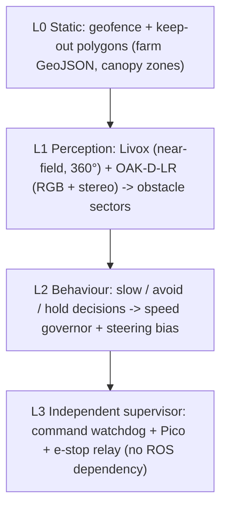
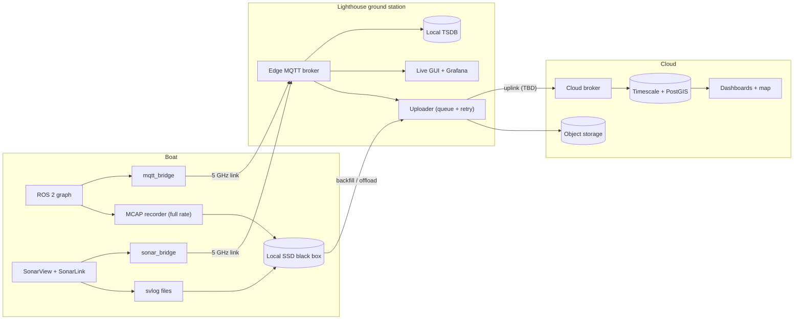
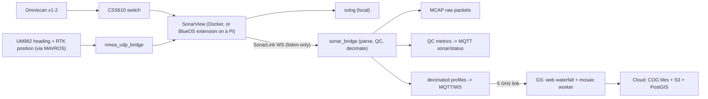
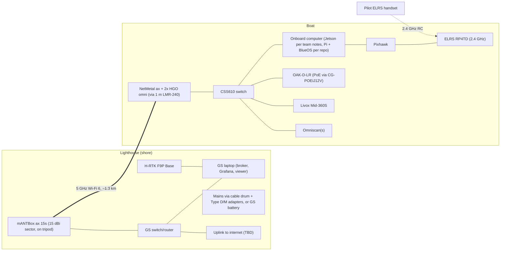

# ASKET 2.0 ASV — Kelp Farm Missions
### Lüderitz (Shearwater Bay), Namibia · NODE Engineering Club · Draft v0.2 · 2026-09-19 · revised after reading `node-ros-2026`

| | |
|---|---|
| **Companion document** | `KELP_CAPABILITIES.md` (component register, compatibility test, integration detail) |
| **Inputs** | `PROJECT_SCOPE_KELP_BLUE.pdf`, the BOM/tools sheet, vendor datasheets, project notes, and the `node-ros-2026` repo (commit `f61b8a3`, 2026-08-06) |
| **Status** | Design proposal. Nothing here has been bench-tested. Code facts come from reading the repo, not from running it. |

---

## 0. Read this first

### 0.1 Tag legend

| Tag | Meaning |
|---|---|
| **[SRC]** | Taken from the scope deck, the BOM, or a vendor/primary document (URL in §9) |
| **[CALC]** | My arithmetic from sourced numbers (assumptions stated next to it) |
| **[PROPOSAL]** | A design recommendation. Yours to accept, change, or reject |
| **[OPEN]** | Needs an answer from the team or from Kelp Blue before we can commit |
| **[VERIFY]** | Believed correct but from a secondary source or memory. Check before relying on it |

### 0.2 What I read, and what I could not

- **`node-ros-2026` is now read** (public repo, commit `f61b8a3` dated 2026-08-06: 13 ROS packages, about 7,900 lines of Python plus the C++ behaviour tree). You said it is a replica of `node-ros-namibia`; that private repo is still unread, so anything that exists only there is invisible to me. Code facts carry the tag **[REPO: file:line]**. The old **[VERIFY-REPO]** tag is retired wherever the code settled the question. §0.4 lists what the repo changed.
- **The repo is six weeks old.** Anything the team did after 6 August (a Jetson port, an MQTT bridge, the GCS) is invisible to me. The Pico 2 firmware and the ArduPilot parameter file are not in the repo either.
- **The Omniscan itself is not in the BOM.** I assume Cerulean supplies it as the partner. Model, quantity, and delivery date are **[OPEN]**.
- **The battery is not chosen.** That decision drives more of this design than any other (see `KELP_CAPABILITIES.md` §4.2).

### 0.3 Five findings that change the plan

1. **The shore uplink cannot be Starlink.** Namibia's regulator rejected Starlink's licence in March 2026 and upheld that decision on 22 June 2026 **[SRC]**. Plan the lighthouse uplink around a local carrier or Kelp Blue's own connectivity, and design cloud history as **store-and-forward** so an outage costs latency, not data (§4.4). The uplink is **[OPEN]**.
2. **The boat never talks to the cloud directly.** In open water the boat has one broadband path, the 5 GHz link to the lighthouse. The shore ground station is the gateway, so it needs its own storage and power, not just a laptop (§6).
3. **Sonar quality is decided by heading, not by the sonar.** A 3° compass error smears a target by about 1.6 m at 30 m range. A dual-antenna GNSS heading of about 0.17° gives about 0.09 m **[CALC]**. That is the main reason the UM982 matters, and why the RTK base is worth more than its "Medium" priority in the BOM.
4. **Kelp is a propeller hazard, and the BESC30 gives no telemetry.** The Blue Robotics Basic ESC does not report current or RPM **[SRC]**. Entanglement has to be detected indirectly (commanded thrust vs. achieved speed) or by adding a current sensor (§2.M2).
5. **2.4 GHz collision.** The NetMetal's 2.4 GHz radio can transmit at roughly 22–29 dBm depending on rate, within centimetres of the 2.4 GHz ELRS receiver **[SRC: MikroTik TX table]**. Disable it on the boat (§6.3).

### 0.4 What reading the repo changed

| # | Finding | Evidence | Effect on this document |
|---|---|---|---|
| 1 | The compute platform in the repo is a **Raspberry Pi running BlueOS 1.4.3 under Podman**, not the Jetson AGX Orin in your September notes | `scripts/init.sh`, `scripts/deploy-pi.sh` (`pi@boat.local`), `.github/workflows/build.yaml` (arm64 image built under QEMU) | The platform is an open decision. Both cases are tracked in `KELP_CAPABILITIES.md` §0.5 |
| 2 | Autonomy is **ROS-side**: Nav2 (NavFn + Regulated Pure Pursuit, 10 Hz, 1.0 m/s) plus BT.CPP `boat_bt_node`, arbitrated by `twist_mux`. ArduPilot supplies IMU, GPS, EKF and an RC-override actuator, not AUTO-mode navigation | `njord.launch.py`, `nav2_params.yaml`, `boat_bt/`, `twist_mux.yaml` | Avoidance "option B" is the real architecture (M2). Open question 8 is closed |
| 3 | **The command watchdog is defeated, not just missing.** `pid_controller` publishes at 20 Hz from a timer and never expires its setpoint, so a dead upstream leaves the last thrust latched. That also hides the failure from `pico_bridge`'s 0.3 s timeout and from ArduPilot's RC-override lapse | `pid_controller.py:48`, `:61-63`; `pico_bridge.py` | Fix before any autonomy trial. Patch in `KELP_CAPABILITIES.md` §5.8; bench test T15 |
| 4 | **`pid_controller` listens on `/imu/data`, which nothing publishes.** Yaw-rate feedback is stuck at 0, and the stale-IMU warning cannot fire because it only checks after a first message | `pid_controller.py:46`; `imu_gps_driver.py` publishes `/imu_driver/imu_raw` | Same patch; bench test T16 |
| 5 | **The Nav2 `collision_monitor` polygon is disabled**, so there is no Nav2-level reflex stop today. `boat_bt` GlobalSafety is the only avoidance, and it acts through `/mission/set_bypass_target`, i.e. only while `mission_manager` is running a mission | `nav2_params.yaml:207`; `boat_bt_node.cpp` | The M2 reflex layer is mostly a configuration job |
| 6 | **Only `actuator_driver` (MAVROS RC override) is launched.** `pico_bridge`, which talks to a Pico 2 that arbitrates AUTO/MANUAL and neutralises on silence, exists but is not in `njord.launch.py`. Its firmware is not in the repo | `njord.launch.py:254-273`; `pico_bridge.py` docstring | Which path is wired on the boat is open (question 16) |
| 7 | Existing perception is a **2D RPLidar (12 m, 10 Hz)** and a **USB camera with CPU YOLO26n-seg**. Camera intrinsics and a LiDAR–camera extrinsic (2.51 px) are calibrated; URDF sensor heights are still wrong | `lidar_driver.py`, `camera_driver.py`, `TODOS.md` | Today's detection horizon is 12 m, not the ~40 m of the Livox. New sensors should plug into the existing topics (M2) |
| 8 | **There is no telemetry code**: no MQTT, battery, leak, health or recorder nodes. `foxglove_bridge` starts by default on port 8765 | repo-wide search; `njord.launch.py:56,362-366` | §4 is all new work. Foxglove must stay off the radio LAN |
| 9 | The URDF has **two propellers** and `pico_bridge` mixes **two outputs**; the BOM has **three** T200 and three BESC30 | `asket.urdf.xacro`; `pico_bridge.py` `_mix` | Spare or third thruster? (question 10). It changes the current and circuit budget |
| 10 | **A GitHub token is hard-coded in a public repo** | `scripts/init.sh:10` | Revoke it now (`KELP_CAPABILITIES.md` C9) |

---

## 1. Mission context

### 1.1 What the client asked for **[SRC: scope deck]**

| # | Scope bullet | Becomes |
|---|---|---|
| 1 | Travel out up to **1.3 km** | M1, M2, link budget (§6.3) |
| 2 | Watch surroundings, flag obstacles and drift off the ideal course back to the pilot | M2, M6 |
| 3 | Show how the stack is thinking: decisions and why | §3 (decision log) |
| 4 | Report own health: battery, hardware status, hull water sensors | §4 |
| 5 | Use Omniscan sonar to scan below, test whether the data picks up kelp structures and infrastructure, show data quality | M3, M4, §5 |
| — | "This isn't a client brief with a deadline… by the end, we want a working MVP out on the water" | §7 MVP cut line |

**Site facts [SRC]:** the pilot farm is about **30 ha**, depths about **6–16 m** including high tide. The scope map's ruler reads about **1,193 m** from shore, heading about 1.9°.

### 1.2 Site model

Kelp Blue grows giant kelp (*Macrocystis pyrifera*), with a pilot farm of more than 30 ha in Shearwater Bay, being installed at about 4 ha per month **[SRC: kelp.blue]**.

> **Consequence [PROPOSAL]:** the farm changes by roughly 4 ha a month. A hard-coded keep-out map goes stale. Treat farm geometry as versioned data (GeoJSON from Kelp Blue, refreshed each campaign) and let the sonar help update it.

Geometry from the scope deck **[SRC]**:

| Element | Value |
|---|---|
| Grid depth below surface | 5–10 m |
| Float/buoy spacing along a line | 20–40 m; cultivation lines spaced 4 m apart |
| Grid unit | roughly 80–200 m across, 10–40 m canopy-free lanes between grids |
| Full section | up to 800 m × 1,200 m, 250 m between sections |
| Anchors | Helical screw anchors; mooring lines rise to subsurface floats |
| Surface marks | Demarcation buoys |
| Mature canopy | Reaches the **water surface** (fully-grown state) |
| Single-plant structure | 30 kg block, 2 m line, 2 L float |

```
   lighthouse GS (mANTBox 15s sector antenna →)
   ═══════════════════════════════════════════════════════════
                 ~1.2–1.3 km over open water
 ┌──────── Grid A ────────┐  lane  ┌──────── Grid B ────────┐
 │ canopy at surface       │ 10–40m │ canopy at surface       │
 │ floats/lines @ 5–10 m   │  free  │ floats/lines @ 5–10 m   │
 └─────────────────────────┘        └─────────────────────────┘
        boat survey lines run in the lanes, sonar looking both ways
```

**Hazards to a small surface vessel [PROPOSAL]:**

| Hazard | Why it matters | Primary sensor |
|---|---|---|
| Floating canopy (mature grids) | Entangles a 76 mm T200 propeller; can stall the boat | Camera (colour/segmentation) + lidar intensity |
| Demarcation buoys | Collision | Lidar + camera |
| Harvest and service vessels | Collision, moving target | Lidar + camera + pilot awareness |
| Shore, rocks, kelp holdfasts | Grounding at 6 m depth and less | Chart/fence + lidar + sonar depth |
| Fishing gear, ropes | Entanglement | Camera + lidar |
| Swell and wind | Lüderitz is a windy coast **[VERIFY: local knowledge]** | Weather limits in §1.3 |

### 1.3 Operating envelope **[PROPOSAL, to agree with Kelp Blue]**

- Daylight only for the MVP.
- Boat stays within visual line of sight of a spotter, and within the 5 GHz link.
- Geofence = farm bounding polygon + approach corridor. Canopy areas are **soft keep-out** (never enter).
- Weather limits (wind, swell, visibility) go into a go/no-go card (M0). Numbers **[OPEN]**.
- Safety boat or shore-launch recovery available (boat hook and retroreflective tape are already in the BOM).

### 1.4 Mission set overview

| ID | Mission | Purpose | Key sensors | Autonomy | MVP? |
|---|---|---|---|---|---|
| **M0** | Harbour acceptance | Prove the boat is safe to launch | All | None | **Yes** |
| **M1** | Manual/assisted transit + link baseline | Learn the real RF envelope, validate telemetry | GNSS, radio | Manual + assist | **Yes** |
| **M2** | Autonomous transit + collision avoidance | Core autonomy demo | Lidar, OAK-D-LR, GNSS | Full | **Yes** (reflex-level) |
| **M3** | Sonar survey, lane-following | The deliverable the client cares about | Omniscan ×1–2, UM982, RTK | Full | **Yes** (single pass) |
| **M4** | Structure verification / ground-truth | Answer "can sonar see the infrastructure?" | Omniscan, known targets | Full | **Yes** (a few targets) |
| **M5** | Repeat-pass monitoring | Change detection over weeks | Omniscan | Full | Post-MVP |
| **M6** | Drift and deviation monitor | "Flag drift off course to the pilot" | GNSS, IMU | Runs in every mission | **Yes** |
| **M7** | Failsafe and recovery | Behaviour when things break | All | Full | **Yes** |
| **M8** | Post-mission offload + QA | Data to cloud, quality report | Storage, uplink | Auto | Partial |

---

## 2. Mission catalogue

### M0 — Harbour acceptance (before *every* sortie)

Run pier-side or in a sheltered basin. Go/no-go:

| Check | Pass criterion |
|---|---|
| Enclosure vacuum test (Mityvac + test terminal) | Holds vacuum for the agreed time; then re-open the equalisation vent path |
| Rail voltages under load | 12 V rails within tolerance; battery ≥ agreed SOC |
| E-stop and main relay | Kills thrusters in < 1 s; telemetry stays alive |
| RTK | RTK-fixed position and valid dual-antenna heading |
| Sonar | Pings received on both channels; no dropped-ping alarms |
| Link | RSSI/rate at 50 m and 200 m matches expected; RTCM age < 2 s |
| RC failsafe | Turn the handset off → thrusters neutral (1500 µs) |
| Command watchdog | Stop Nav2 / `twist_mux` (upstream), then `pid_controller`: thrusters go neutral within 1 s on **both** actuation paths. **Fails today** (§0.4 #3) |
| Yaw feedback | Rotate the hull by hand: the yaw-rate input to `pid_controller` is non-zero. **Fails today** (§0.4 #4) |
| Reflex stop | `collision_monitor_state` changes when a stand-in enters the stop polygon. The polygon is disabled today (§0.4 #5) |
| Leak sensors | Reading dry; tap test triggers alarm |

### M1 — Manual/assisted transit + link baseline

**Objective:** learn the *real* link envelope and prove the telemetry pipeline before trusting autonomy.

- Pilot drives out in ~200 m steps to about 1.3 km and back.
- Logs at every step: RSSI, chain balance, negotiated rate, packet loss, ping RTT, RTCM age, ELRS link quality.
- **Output:** a link-vs-distance table, used to set the maximum MCS and the alert thresholds in §4.6.
- **Acceptance [PROPOSAL]:** live position and health visible at the GS the whole way; no telemetry gap longer than 2 s except a deliberate test.

### M2 — Autonomous transit + collision avoidance (core)

**Objective:** drive shore → farm → shore on waypoints, stopping or diverting for hazards, and explain each decision.

**Four safety layers (each can fail without losing the next) [PROPOSAL]:**



**Sensor roles [SRC + CALC]:**

| Sensor | Strength here | Weakness here |
|---|---|---|
| RPLidar 2D (existing; 12 m, 10 Hz, 360 rays) **[REPO: `sensors/lidar_driver.py`]** | Already wired into the costmaps, `collision_monitor`, the docking detector and fusion; runs on hardware | 2D slice only; scan plane is about 5 cm above the hull, close to the water (`TODOS.md`); 12 m limit |
| Livox Mid-360S (mounted **inverted**) | 360° azimuth; sees 52° below and 7° above the horizon, so water-level objects near the boat are covered. About 40 m at 10% reflectivity | Water returns are poor at grazing angles; the lidar sees the canopy as a surface, not as "hazard" |
| OAK-D-LR RGB | Colour distinguishes golden-brown canopy from blue water; runs NNs on-device | Glare; needs a trained model |
| OAK-D-LR stereo (15 cm baseline) | Precise depth to about 30 m on solid objects | Featureless or glittering water gives poor disparity |

**Hazard → response table [PROPOSAL]:**

| Situation | Trigger | Response |
|---|---|---|
| Static obstacle ahead | Cluster on the path within the slow-down distance | Slow → steer around (bounded) → hold if boxed in |
| Canopy edge ahead | Camera canopy fraction above threshold on path | Treat as hard keep-out; stop at standoff, then replan or return |
| Moving vessel | CPA under threshold | Slow and alert the pilot; do not try clever COLREG manoeuvres in MVP |
| Sensor degraded | Lidar or camera stale for more than 500 ms | Speed cap, then hold |
| Entanglement suspected | Thrust command high but speed-over-ground low for more than N s | Stop thrust, alert, hold |

**Detection horizon rule [PROPOSAL]:** `d_detect ≥ v × t_latency + d_stop + margin`. Measure `d_stop` on the water, not on paper (thrust reversal, hull drag). Do not set speeds until that test is done (M1 add-on). With the existing RPLidar and a 0.4 s scan-to-command latency **[CALC, latency assumed]**:

| Speed | Distance covered during latency | Left for stopping + margin if detection is at 12 m (sensor limit) | Left if detection is at 8 m (pessimistic for a small, dark buoy **[VERIFY]**) |
|---|---|---|---|
| 1.0 m/s | 0.4 m | 11.6 m | 7.6 m |
| 1.5 m/s | 0.6 m | 11.4 m | 7.4 m |

If the boat stops in a few metres, the existing 2D lidar is enough for a reflex layer at survey speeds. The Livox (about 40 m) buys margin and 3D awareness, not the basic capability. Measure `d_stop` first.

**How avoidance works in the repo today [REPO].** The stack is ROS-side. `mission_manager` feeds waypoints to Nav2 `NavigateToPose`; Nav2's output passes `collision_monitor` (`/nav2/cmd_vel`, priority 10) into `twist_mux`; `boat_bt_node` publishes docking commands at priority 100; the result goes `nav_to_pid` → `pid_controller` → `actuator_driver` → MAVROS RC override (or `pico_bridge` → Pico 2). ArduPilot's own BendyRuler is not in the loop, so the ArduPilot-side option from v0.1 is dropped.

| Layer | What exists in the repo | Status | Work for the Kelp MVP **[PROPOSAL]** |
|---|---|---|---|
| L0 static | Nothing: no geofence, no keep-out layer | Missing | Nav2 keep-out costmap filter from the farm GeoJSON, plus a geofence check in `mission_manager` before it accepts waypoints |
| L1 perception | `lidar_obstacle_node` → `/obstacles/lidar`; `fusion_node` → `/obstacles/fused` (Nav2 costmaps); `geo_fusion_node` → `/obstacles/global` (with a tracker) | Built and sim-tested; hardware checks are open in `TODOS.md` | Make the Livox and OAK-D-LR look like the sensors already wired in (below) |
| L2 behaviour | `boat_bt_node` GlobalSafety: 20 m range, ±60° sector, 12 m bypass offset, 5 s cooldown, side chosen by bearing (not COLREG). Nav2 `collision_monitor` approach polygon | BT built; **polygon disabled** | Enable and tune a stop polygon; add a speed governor; leave the BT bypass as is |
| L3 supervisor | `pico_bridge` heartbeat and Pico 2 firmware (docstring: 500/600 ms timeouts; motors only when armed + AUTONOMOUS + 2 s after the relay) | Firmware not in the repo; ROS-side masking bug (§0.4 #3) | Fix the watchdog; read the firmware; test both paths |

**Make the new sensors look like the old ones [PROPOSAL].** Every consumer (`collision_monitor`, `lidar_obstacle_node`, the docking detector, the fusion nodes) reads `/lidar_driver/scan_raw` (LaserScan, frame `lidar`, 0.2–12 m, 360 rays, 10 Hz). The fastest safe path is: Livox → `livox_ros_driver2` (PointCloud2) → a point-cloud-to-laser-scan slice at waterline height **[VERIFY: package availability for Jazzy]** → publish on that topic. Nothing downstream changes. The Livox is mounted inverted, so the slice window and the `lidar` frame need the roll-180° extrinsic, and `dock_detector_node`'s `lidar_yaw_offset_deg` (90°, derived in simulation) depends on the mount. For the camera, the OAK-D-LR RGB stream can publish to `/front_camera_driver/image_raw` and `camera_info`. Intrinsics and the LiDAR–camera extrinsic must be redone for new hardware, so the 2.51 px result does not carry over.

**[PROPOSAL] MVP path:** (1) apply the patch in `KELP_CAPABILITIES.md` §5.8 (watchdog, IMU topic); (2) measure `d_stop`; (3) enable and tune the `collision_monitor` stop polygon; (4) run waypoint chains for transit; (5) keep the BT bypass as the steer-around and treat improvements as post-MVP. That delivers an honest "flag obstacles, stop, hold" inside the calendar.

**Prerequisites, now confirmed in code:** the `/imu/data` subscription and the latched-setpoint gap (§0.4 #3 and #4). Both must be closed and bench-tested (T15, T16) before M2.

**Acceptance criteria [PROPOSAL, tune after the stop-distance test]:**

- 10 of 10 runs stop or divert clear of a demarcation-buoy stand-in at approach speed *v₀* (set after the stop test).
- Zero entries into a marked canopy stand-in.
- Every stop/divert has a matching `decision_log` entry with a reason code.
- The M0 kill-upstream test passes on the actuation path(s) that are wired.

### M3 — Sonar survey, lane-following

**Objective:** produce georeferenced side-scan coverage of the farm, live enough to steer the survey and good enough to judge the sonar.

**Sonar facts [SRC]:** Omniscan 450 SS, 450 kHz, beam 0.5° × 50°, up to 150 m range, ≤20 pings/s at ranges ≤30 m, 100BASE-T, 10–30 V, 5 W idle/10 W pinging.

**Line design [CALC]:**

| Design variable | Rule / value |
|---|---|
| Range setting | 30–50 m. At ≤30 m the max ping rate is 20 pps; at 50 m it drops to about 15 pps |
| Speed | 1.0–1.5 m/s. At 20 pps: 5–7.5 cm between pings. Beam footprint at 30 m is about 26 cm, so along-track sampling is comfortable |
| Line spacing | ≤ 2 × usable range per side, minus overlap. 40–80 m spacing is realistic |
| Full 30 ha coverage | 40 m spacing → 7.5 km ≈ **83 min** at 1.5 m/s; 80 m spacing → 3.8 km ≈ **42 min**. Expect 1–2 sorties |
| Transit | 1.3 km ≈ 14 min at 1.5 m/s (each way) |

**Repo constraints on lane-following [REPO].** Nav2 runs Regulated Pure Pursuit at 10 Hz with `desired_linear_vel: 1.0` and a 2 m lookahead; `nav_to_pid` clamps at 2 m/s and 1 rad/s; `mission_manager` feeds waypoints one at a time through `NavigateToPose` with a 0.5 m goal tolerance (yaw ignored). That is enough to fly lawnmower lanes as waypoint chains at about 1 m/s. It is not a tight line tracker: expect cross-track error of the order of the goal tolerance plus controller lag, and measure it with the M6 monitor. RTK georeferencing means lane wobble costs coverage overlap, not position accuracy. Running 1.5 m/s needs `desired_linear_vel` raised **[PROPOSAL]**.

**Mounting geometry (the part people get wrong) [SRC + CALC]:** Cerulean advises about 20–25° downward tilt for maximum range from height, and scanning from above so objects cast shadows. But the farm grid sits 5–10 m *below the surface*, at 5–30 m lateral offset from a lane line:

| Grid depth below transducer | Lateral offset 5 m | 10 m | 15 m | 20 m | 30 m |
|---|---|---|---|---|---|
| 5 m | 45° | 27° | 18° | 14° | 9° |
| 7 m | 54° | 35° | 25° | 19° | 13° |
| 10 m | 63° | 45° | 34° | 27° | 18° |

(Angle below horizontal. Main lobe is about ±25° around the tilt axis.) A 25° tilt centres on structure 15 m to the side at 7 m depth. **[PROPOSAL]** Make the transducer brackets **adjustable from about 15° to 45°**. The BR Cerulean Integration Kit in the BOM is only a geometry reference, so the mounts are yours to design, and this is cheap to build in now.

Bottom coverage for reference (tilt 25°, beam edges 0–50° below horizontal): near edge about 5 m (6 m depth), about 8 m (10 m depth), about 13 m (16 m depth).

**Heading and position quality [CALC]:**

| Source | Heading error | Cross-track smear at 30 m |
|---|---|---|
| UM982 dual antenna (vendor-class ~0.1°/m of baseline; 0.6 m baseline ≈ 0.17°) **[VERIFY]** | ~0.17° | ~9 cm |
| Compass, typical near thrusters | 3° | ~1.6 m |
| Compass, bad day | 5° | ~2.6 m |

**How heading reaches ROS [REPO].** The EKF takes absolute yaw from `/imu_driver/imu_raw`, which `imu_gps_driver` relays from `/mavros/imu/data` (ArduPilot's own attitude estimate); `navsat_transform_node` uses odometry yaw with zero declination and zero yaw offset. Once ArduPilot is set up for GPS yaw (Capabilities §5.5), UM982 heading therefore reaches Nav2 and the EKF with no code change. The sonar NMEA bridge should read heading from the same MAVROS attitude source **[VERIFY topic]**.

**Procedure [PROPOSAL]:**

1. M0 passes; RTK fixed; heading valid.
2. Transit to the survey start on M2 rules.
3. Fly the lanes in a lawnmower pattern at set speed/range; SonarView is fed NMEA position + heading over UDP.
4. Auto-pause the line (hold, do not abort) if heading invalid, RTK lost for more than N s, or ping loss above 5%.
5. Log everything at full rate to the boat's local SSD (medium **[OPEN]**, see §4.4); stream a decimated view live (§5).
6. Return; offload (M8).

**Success criteria [PROPOSAL]:** more than 95% of planned line length surveyed with valid heading and position; ping loss below 2%; mosaic seams under 1 m.

### M4 — Structure verification / ground-truth

**Objective:** answer the client's real question: *can this sonar see the kelp infrastructure?* Make it measurable.

**Targets to ask Kelp Blue for [OPEN]:** surveyed positions of subsurface floats, anchor points, grid corners, demarcation buoys; depth of grid lines at test time.

**Hypotheses [PROPOSAL]:**

| ID | Hypothesis | Metric |
|---|---|---|
| H1 | Gas-filled subsurface floats produce a detectable return at 15–30 m lateral range | Detection rate; max range |
| H2 | Mooring lines and grid ropes are visible as thin lines | Visible yes/no; along-line continuity |
| H3 | Helical anchors and blocks are visible on the seabed | Detection rate; position error against known coordinates |
| H4 | Canopy and kelp bodies show as a clutter/texture class distinct from open water | Separable in backscatter statistics |

**Context [SRC: peer-reviewed]:** multibeam water-column data at 200–400 kHz shows clear echoes from giant kelp, with backscatter about 2–4 dB lower over thinned stands. Multibeam is not side-scan: a side-scan sonar returns range only, with no angle, so structure in the water column is ambiguous in depth. Treat H1–H4 as experiments, not promises.

**Method:** run passes at 10 / 15 / 25 m offsets from a known line, two tilt settings, two speeds. Score against known coordinates. Deliver a one-page detection table.

### M5 — Repeat-pass monitoring (post-MVP)

Repeat the same lines weekly at fixed settings. Compare mosaics for growth, drift of floats, and damage. Requires stable georeferencing (RTK base + UM982) and a consistent data pipeline. Worth doing only once M3/M4 are trusted.

### M6 — Drift and deviation monitor (runs in every mission)

**Objective:** tell the pilot when the boat is off the ideal course, and by how much.

| Metric | Source | Warn / alarm **[PROPOSAL]** |
|---|---|---|
| Cross-track error | Planned line vs. RTK position | > 3 m warn; alarm at min(8 m, 0.4 × lane half-width) |
| Heading error | Desired vs. UM982 heading | > 10° sustained |
| Speed-made-good vs. commanded | GNSS velocity vs. thrust | Drops more than 30% for more than 5 s (entanglement or current) |
| Set/drift estimate | Sliding window of residuals | Shown on the GS as a vector |

### M7 — Failsafe and recovery

**Escalation ladder [PROPOSAL]:**

| Condition | Action |
|---|---|
| Link to GS lost more than 10 s | Hold (stop, do not drift into canopy) |
| Link lost more than 60 s | SmartRTL (retrace the known-safe track) |
| Battery below return-energy + reserve | RTL |
| Leak sensor | Stop, alert, RTL |
| RTK lost during survey | Pause line; transit allowed on plain GNSS |
| Any watchdog trip | Thrusters to neutral |
| RC handset takes over | Manual override wins |

**Recovery aids:** boat hook, retroreflective tape (BOM), plus an independent low-power position beacon **[PROPOSAL]**. The existing ESP32 + SIM7000G MQTT bridge can serve if there is cellular coverage offshore, **[OPEN]**: test coverage in Shearwater Bay and confirm band support with the local carriers **[VERIFY]**.

### M8 — Post-mission offload + QA

- On return, the GS pulls logs by an integrity-checked rsync/HTTP job (checksums, resumable).
- Generates a **mission report**: track, time on line, RTK %, ping loss, link stats, alerts, decision-log summary, sonar QC scores (§5.6).
- Uploads to cloud when the uplink allows (§4.4).

---

## 3. Autonomy stack and "showing how it thinks"

```mermaid
flowchart LR
  MM["mission_manager (waypoint queue)"] -->|NavigateToPose| N2["Nav2: NavFn + Regulated Pure Pursuit, 10 Hz"]
  PER["Perception: /obstacles/fused, /obstacles/global"] --> N2
  PER --> BT["boat_bt_node: GlobalSafety, docking"]
  BT -->|set_bypass_target| MM
  N2 --> CM["collision_monitor (polygon DISABLED today)"]
  CM -->|"nav2/cmd_vel, priority 10"| TM["twist_mux"]
  BT -->|"boat_bt/cmd_vel, priority 100"| TM
  TM -->|"/cmd_vel"| N2P["nav_to_pid: clamp 2 m/s, 1 rad/s"]
  N2P --> PID["pid_controller: 20 Hz, stale setpoint never expires"]
  PID -->|"/control/effort"| ACT["actuator_driver (launched)"]
  PID -->|"/control/effort"| PB["pico_bridge (NOT launched)"]
  ACT --> MAV["MAVROS RC override to ArduPilot"]
  PB --> PICO["Pico 2 firmware (not in repo)"]
  MAV --> ESC["ESCs and thrusters"]
  PICO --> ESC
  BT --> DL["decision_log (new)"]
  N2 --> DL
```



### 3.1 Decision log **[PROPOSAL]**

A single topic, `/node/decision`, one message per *decision change* plus a 1 Hz heartbeat. Every stop, slow, divert, hold, and pause writes one.

```json
{
  "t": "2026-11-03T09:14:22.412Z",
  "mission": "M3-2026-11-03-A",
  "state": "SURVEY_LINE",
  "behaviour": "SLOW",
  "reason": "OBSTACLE_AHEAD",
  "detail": {"nearest_m": 14.2, "bearing_deg": -8, "source": "livox", "conf": 0.91},
  "inputs": {"xtrack_m": 1.1, "sog_mps": 1.4, "rtk": "FIXED", "link_dbm": -63, "batt_pct": 71},
  "action": {"speed_cap_mps": 0.6, "steer_bias_deg": 0}
}
```

- Stored locally (MCAP) and streamed to the GS at event rate.
- The GUI shows a **"why is it doing this?"** panel: current behaviour, reason, and the three inputs that drove it.
- Reason codes are an enum, so the cloud can chart "time spent per behaviour".

**What already exists to build on [REPO].** `/competition/status` (task and lifecycle, transient-local), `/mission/status` (`MissionStatus`), `/collision_monitor_state`, `/pico/status` (String, `STATE ...` lines every 250 ms) and the 10 Hz tick loop in `boat_bt_node`. None of these is a structured, reason-coded decision. Two options: emit the JSON above from inside `boat_bt_node` (C++, cleanest), or write a small Python node that subscribes to those topics and infers the behaviour (faster to build, less exact).

### 3.2 Supervisor independence

The watchdog and the Pico e-stop path must **not** depend on ROS being healthy. If the onboard computer hangs, the thrusters must go neutral on their own. `pico_bridge` is designed to do this: it sends `L,R` while commands are fresh and `PING` otherwise, and the Pico neutralises on silence (500/600 ms per the docstring) **[REPO; firmware unread]**. In practice the ROS side defeats it, because `pid_controller` keeps publishing stale effort (§0.4 #3). Fixing that is the strongest single item before any autonomy trial.

---

## 4. Boat navigation monitor and cloud history

**Why it exists:** at 1.3 km in open water you cannot walk over and look. If the link drops, you still want to know what happened. So: the boat keeps a black box; the shore keeps a live copy; the cloud keeps history.

### 4.1 Signal catalogue

| Group | Signals | Local log | Live to GS | To cloud |
|---|---|---|---|---|
| **Navigation** | Lat/lon/alt, RTK fix type, sats, HDOP, correction age, heading, COG/SOG, roll/pitch/yaw, xtrack error, waypoint index, mode | Full rate | 5–10 Hz | 1 Hz (+ events) |
| **Power** | Battery V/I/Wh used/SOC, per-rail V, board temps | 10 Hz | 1 Hz | 0.2 Hz |
| **Propulsion** | Thruster command (µs), throttle limits | Full | 5 Hz | 1 Hz |
| **Comms** | RSSI per chain, tx/rx rate, packet loss, RTT, MQTT queue depth, ELRS LQ, cellular state | 1 Hz | 1 Hz | 0.2 Hz |
| **Compute health** | CPU/GPU/RAM/disk, SoC temperature (`tegrastats` on a Jetson, `vcgencmd` on a Pi), throttle flags, node liveness, watchdog state | 1 Hz | 1 Hz | 0.1 Hz |
| **Hull and enclosure** | Leak sensors, internal humidity/temp/pressure, e-stop/relay state, Pico heartbeat | 1 Hz | 1 Hz | 0.2 Hz |
| **Perception** | Nearest obstacle per sector, lidar/camera rates, depth-valid %, canopy fraction | 10 Hz | 2 Hz summary | 0.2 Hz |
| **Sonar health** | Ping rate, range, gain index, min/max power (dB), dropped pings, QC score | Per ping | 1 Hz | 0.2 Hz |
| **Decisions** | `decision_log` events | Full | Events | Events |

**Throttle rule [SRC: prior learning]:** publish to the GUI at 5–10 Hz while control loops keep full ROS rate.

Rates for lidar, camera, and raw sonar are **not** streamed live: 200 k points/s of lidar is about 3.2 MB/s raw **[CALC]**, so it is logged locally and only summaries cross the link.

**Existing sources [REPO]:** `/mavros/state`, `/mavros/battery` (only if ArduPilot has a battery monitor configured, **[OPEN]**), `/mavros/rc/override`, `/pico/status`, `/competition/status`, `/mission/status`, `/collision_monitor_state`, `/odometry/filtered`. **Not in the repo:** an MQTT bridge, battery/leak/humidity/temperature publishers, a recorder, a health monitor. `foxglove_bridge` starts by default on port 8765 with no authentication; on the boat it must be bound to the boat LAN or firewalled, not exposed on the radio link.

### 4.2 MQTT topic taxonomy **[PROPOSAL]**

```
node/<site>/<vehicle>/<stream>/<name>

node/lud/asket2/nav/state            QoS0, 5–10 Hz, JSON
node/lud/asket2/health/power         QoS1, 1 Hz, retained
node/lud/asket2/health/comms         QoS1, 1 Hz
node/lud/asket2/events/decision      QoS1, on change
node/lud/asket2/events/alarm         QoS1, retained
node/lud/asket2/sonar/status         QoS1, 1 Hz
node/lud/asket2/sonar/profile        QoS0, decimated ping stream (binary)
node/lud/asket2/status/online        retained; Last Will = "offline"
```

- Every message carries `mission_id`, `seq` (monotonic), and a UTC timestamp. `(mission_id, seq)` makes backfill idempotent.
- Last Will and Testament gives an immediate "boat offline" state.
- Use MQTT-over-WebSocket for browsers (`mqtt.js`). Do **not** carry `rosbridge`/`roslibjs` across the radio link; it was already found to fail off the local network **[SRC: prior learning]**.

### 4.3 Where each piece lives



### 4.4 Store-and-forward design **[PROPOSAL]**

| Tier | Holds | Survives |
|---|---|---|
| **0 Boat SSD** | Everything, full rate (MCAP + svlog) | Link loss, uplink loss, GS loss |
| **1 Shore GS** | Live stream + local TSDB + queue for cloud | Uplink loss (hours to days) |
| **2 Cloud** | Curated history, mosaics, reports | Everything (the long-term record) |

**Storage medium [OPEN].** The BOM has no SSD or NVMe line. A Jetson dev kit has an M.2 slot **[VERIFY]**; a Pi 5 needs a HAT or a USB SSD. Do not log to a microSD card that can be cut off mid-write.

Rules: boat → shore is **at-least-once** with `(mission_id, seq)` dedupe; a gap detector on the shore requests backfill from the boat when the link returns; shore → cloud drains a persistent queue. **Cloud never blocks the boat.**

**MVP-light [PROPOSAL]:** run the "cloud" stack as `docker compose` on the GS laptop for the first campaign (broker + Timescale + Grafana). It exercises the same schemas and topics; swapping in a hosted broker later is a config change. This matches the earlier MVP-first preference to defer the heavy backend, without losing the design.

### 4.5 Cloud stack **[PROPOSAL]**

| Layer | Choice | Note |
|---|---|---|
| Broker | EMQX or HiveMQ (already in your GCS design) | Rule engine can write straight to the DB |
| Time-series + geo | **TimescaleDB + PostGIS** | Tracks, waypoints, detections and telemetry in one database |
| Objects | S3-compatible storage | svlog, MCAP, COG mosaics, reports |
| Dashboards | Grafana + map (MapLibre or Leaflet) | Reuse Leaflet/Chart.js if already built |
| Region | Nearest to Namibia (Cape Town class) | Measure latency; do not assume |
| Security | TLS, per-device credentials/ACLs; VPN (Tailscale/ZeroTier) for admin only | No open inbound ports on the boat |

**Schema sketch:**

```sql
-- hypertables (Timescale)
nav_state   (ts, mission_id, seq, lat, lon, alt, heading, sog, cog, rtk, xtrack, mode, geom)
health      (ts, mission_id, seq, key, value)          -- narrow, easy to extend
events      (ts, mission_id, seq, kind, reason, detail jsonb)
sonar_qc    (ts, mission_id, sensor, ping_hz, dropped, gain, min_db, max_db, score)
-- relational / PostGIS
missions    (id, type, start_ts, end_ts, operator, notes)
detections  (id, mission_id, ts, geom, class, conf, range_m, source)
farm_geom   (version, geom, source, valid_from)
```

Add continuous aggregates (1 s → 1 min) and a retention policy (e.g. raw 30 days, aggregates kept).

### 4.6 Alert rules **[PROPOSAL, tune after M1]**

| Alert | Condition | Severity |
|---|---|---|
| Boat offline | LWT or no heartbeat 5 s | Critical |
| Cross-track | See M6 | Warn/Critical |
| Link margin | Below ~6 dB above the current rate's sensitivity | Warn |
| Link critical | RSSI worse than −75 dBm | Critical |
| Battery | Below return-energy + reserve | Critical |
| Leak | Any | Critical |
| RTK lost | During survey | Warn (pauses line) |
| Heading invalid | During survey | Critical (pauses line) |
| Computer hot | Above 80 °C sustained (SoC or enclosure) | Warn |
| Enclosure humidity | Rising trend | Warn |
| Sonar | Ping loss above 5% over 10 s, or no data for 3 s | Warn |
| Watchdog | Any trip | Critical |
| Disk | Below 15% free | Warn |

### 4.7 Navigation monitor screen **[PROPOSAL]**

One page: live map (track, planned lines, farm polygons, obstacles), cross-track bar, link/RTK/battery strip, "why" panel (§3.1), sonar waterfall + QC badge, camera thumbnail, alarm list. Dark mode; nothing needs a keyboard while the pilot is watching the boat.

---

## 5. Sonar data pipeline and live visualisation

### 5.1 What the sensor and software give you **[SRC]**

- Omniscan speaks a packet protocol over Ethernet. `os_ping_params` (ID 2197) starts/stops pinging (range, gain index or auto, 200–1200 samples/profile, 600 typical). `os_mono_profile` (ID 2198) returns each ping with `ping_number`, `timestamp_ms` (since power-up), `gain_index`, `num_results`, speed of sound, transducer/vehicle heading fields, min/max power in dB, and the power samples as u16.
- **SonarView** is the intended host: real-time bottom detection, real-time georeferenced mosaic if given position and heading, and logging for replay. It accepts **NMEA over serial or UDP** for position and heading. It runs as a Docker image (`network_mode: host`, web UI on port **7077**) on a Linux computer, or, on a BlueOS Pi, as a **BlueOS extension**. Cerulean's own description of the extension route is that it keeps 100% of the survey data onboard, independent of the link **[SRC: Blue Robotics forum, §9]**. The repo's Pi path already runs BlueOS 1.4.3; a Jetson path uses the Docker image.
- **SonarLink**, the process behind SonarView, exposes `GET /status` and a **listen-only WebSocket** (`ws://host:7077/connect_ws?session_id=N`) that streams the raw Cerulean-protocol packets. This is the supported tap for third-party code. It needs SonarView v1.12.3-beta or newer.
- Default device IP is 192.168.2.92; SonarView's discovery protocol can re-address the sonar. Discovery uses Ethernet broadcast, and **Wi-Fi normally blocks it**. Run SonarView on the boat and open only its web UI remotely.

### 5.2 Pipeline



`sonar_bridge` and `nmea_udp_bridge` are **new code to write** **[PROPOSAL]**. Both are small (parse fixed packet layouts, send UDP NMEA sentences).

### 5.3 Data budget **[CALC]**

Per ping about `2 × samples + ~64 B`. Two sensors at 20 pps:

| Samples/ping | Per sensor | Two sensors | Per hour (two) |
|---|---|---|---|
| 300 | 13 KB/s | 0.21 Mbps | ~0.10 GB |
| 600 (typical) | 25 KB/s | 0.40 Mbps | ~0.18 GB |
| 1200 | 49 KB/s | 0.79 Mbps | ~0.35 GB |

Live stream target: about 5 pps at 300 samples ≈ 3 KB/s/sensor. Full-rate data stays on the local SSD and is offloaded after the mission. Even the worst case is small next to the radio link; the constraint is the shore uplink, not the boat.

### 5.4 Live visualisation tiers

| Tier | What | Effort | When |
|---|---|---|---|
| **T1** | Open SonarView's own web UI (`boat:7077`) from the GS laptop, fed with NMEA heading/position | Low | **MVP** |
| **T2** | Lightweight waterfall widget in your GCS (WebSocket of decimated profiles), both channels plus a QC badge | Medium | MVP-stretch |
| **T3** | Near-live georeferenced mosaic: a worker georeferences each ping and appends to a tile pyramid; MapLibre overlay with farm GeoJSON, refreshing every 10–30 s | Medium–high | Post-MVP |
| **T4** | Post-mission: export from svlog → Python → COG mosaic + detections → cloud | Medium | Post-MVP |

### 5.5 Georeferencing

Each ping is placed from: vehicle position (RTK), heading (UM982), transducer lever-arm and tilt, time offset, and the 0.5° along-track footprint.

- **Timestamps:** `timestamp_ms` counts since sonar power-up, not UTC. Map it to UTC using SonarView's UTC-time support and a clock-offset estimate. **[OPEN]**: settle time sync (§6.6) before trusting seams.
- **Latency:** log the age of position/heading at ping time; correct in post.
- **Lever arms:** measure GNSS antenna phase centres and transducer positions relative to `base_link`; store in the vehicle description (see Capabilities §5.4).

### 5.6 Data quality metrics (answers the "show data quality" bullet) **[PROPOSAL]**

| Metric | How | Why |
|---|---|---|
| Ping rate achieved vs. target | Count `ping_number` continuity | Detects dropped pings |
| Noise floor / dynamic range | `min_pwr_db`, `max_pwr_db` per ping | Gain and interference issues |
| Gain index and range | Echo the settings | Explains apparent brightness changes |
| Georef validity | RTK fixed and heading valid at ping time | Only valid pings enter the mosaic |
| Attitude at ping | Roll/pitch from the IMU | Beam geometry error |
| Bottom-track confidence | From SonarView | Water-column vs. seabed |
| **Composite QC score** | Weighted 0–100, per minute | One number per line for the report |

### 5.7 Storage layout and formats

```
s3://<bucket>/node/lud/<vehicle>/<YYYY>/<mission_id>/
  manifest.json            # files, sizes, SHA-256, software versions, params
  sonar/raw/*.svlog        # native, replayable
  sonar/raw/*.mcap         # parsed packets + metadata
  sonar/mosaic/*.tif       # Cloud-Optimised GeoTIFF
  sonar/detections.geojson
  nav/*.mcap
  report/mission_report.pdf
```

Keep raw immutable. Derived products are reproducible from raw plus the manifest.

---

## 6. Network: ground station ↔ boat

### 6.1 Topology



### 6.2 Link inventory

| Link | Purpose | Band | Priority |
|---|---|---|---|
| **L1 Wi-Fi 6 backhaul** | Telemetry, sonar UI, RTCM, video preview, backfill | 5 GHz | Primary |
| **L2 ELRS RC** | Manual override, minimal telemetry | 2.4 GHz | Safety-critical |
| **L3 ESP32 + SIM7000G MQTT beacon** | Position/heartbeat only | Cellular | Tertiary, coverage **[OPEN]** |
| **L4 Harbour Wi-Fi** (existing GL.iNet/Alfa gear) | Bench and pier access | 2.4/5 GHz | Maintenance only |
| **L5 Shore uplink** | Cloud sync | Local carrier | **[OPEN]**, not Starlink |

**Redundancy honesty:** L1 is a single point of failure for everything except manual control (L2) and the beacon (L3). The BOM has no RFD900x-class independent telemetry radio. ArduPilot can send basic telemetry (battery, GPS, attitude, mode) down the CRSF link to the handset, which gives the pilot a minimal second view **[VERIFY]**. Decide whether that is enough or whether to add an independent MAVLink radio.

### 6.3 Link budget **[CALC + SRC]**

Assumptions: 5.5 GHz, shore 15 dBi sector, boat omni (datasheet 5.5–6.7 dBi; I use the worst case 5.5), 1.5 dB cable and connector loss, transmit power from MikroTik's table (28 dBm at MCS0, 25 at MCS7, 23 at MCS9, 20 at MCS11), receive sensitivity −75 dBm (MCS7), −70 (MCS9), −67 (MCS11).

| Distance | Free-space loss | RSSI at MCS7 (TX 25 dBm) | Margin vs. MCS7 sensitivity |
|---|---|---|---|
| 1.3 km | 109.5 dB | −65.5 dBm | **+9.5 dB** |
| 2.0 km | 113.3 dB | −69.3 dBm | +5.7 dB |
| 3.0 km | 116.8 dB | −72.8 dBm | +2.2 dB |

At 1.3 km, MCS9 has only +2.5 dB and MCS11 is negative. **Do not plan on high MCS.**

**Why 9.5 dB is thinner than it looks:** over water, the sea-reflected path interferes with the direct path. Path difference ≈ `2·h_boat·h_shore / d`. With the boat antenna 1 m above the water and the shore antenna 10–20 m up, at 1.3 km the two paths differ by only about 0.3–0.6 wavelengths, so the boat moving up and down a few tens of centimetres swings you through fades of roughly ±6 dB or more **[CALC, indicative]**.

**Recommendations [PROPOSAL]:**

1. Mount the shore sector as **high as the lighthouse allows**, vertical polarisation at both ends.
2. Use **both chains** on the boat (two HGO antennas separated by at least about half a metre).
3. Cap the rate (say MCS ≤ 5–7), use 20 MHz channels for better sensitivity.
4. **Disable the 2.4 GHz radio on both MikroTik units** to protect the ELRS receiver.
5. Verify Namibian rules for outdoor 5 GHz channels and EIRP, and RouterOS country settings **[OPEN]**.
6. Treat the M1 range walk as the real link budget.

### 6.4 Addressing and services **[PROPOSAL]**

Default addresses collide: Livox 192.168.1.1xx (static only), Omniscan 192.168.2.92, MikroTik 192.168.88.1 **[SRC]**. Re-address everything into one plan. The Livox can be re-addressed with Livox Viewer 2 and its driver config; the Omniscan via SonarView discovery **[SRC]**.

| Segment | Subnet | Members |
|---|---|---|
| Boat LAN | 10.10.20.0/24 | CSS610 .2, NetMetal .3, onboard computer .10, OAK-D-LR .21, Livox .22, Omniscan P .31, Omniscan S .32 |
| Shore LAN | 10.10.10.0/24 | mANTBox .2, GS laptop .10, edge broker .11 |
| Radio link | 10.10.99.0/30 | NetMetal .1 ↔ mANTBox .2 |

**Route (Layer 3) between the two LANs; do not bridge.** That keeps broadcast/multicast (ROS 2 DDS discovery, mDNS, SonarView discovery) confined to the boat.

Resolve the onboard computer by hostname rather than IP, per the earlier lesson (`node2026.local` on the Jetson; `boat.local` in the repo's deploy script).

**BlueOS note [VERIFY].** BlueOS has its own default companion address in the 192.168.x.x range (a Blue Robotics forum post refers to it that way; I did not confirm the exact subnet). The Omniscan default, 192.168.2.92, sits in the same range. On the Pi path, either adopt the BlueOS plan on the boat LAN or re-address everything as above, and check that BlueOS's network settings accept it.

| Service | Port | Direction |
|---|---|---|
| SonarView web UI / SonarLink | 7077/TCP | GS → boat (HTTP + WS) |
| MQTT / MQTT-TLS | 1883 / 8883 | boat → shore broker |
| MQTT WebSocket | 8083/8084 (broker-dependent) | GUI → broker |
| RTCM (F9P → boat) | UDP (choose one) | GS → boat |
| SSH | 22 | GS → boat (allow-listed) |
| Foxglove bridge | 8765/TCP | **Launched by default** [REPO]; bind or firewall to the boat LAN only |
| RouterOS API/WinBox | 8728/8291 | Management LAN only |

### 6.5 Bandwidth budget **[CALC]**

| Flow | Rate |
|---|---|
| Telemetry, decisions | < 0.1 Mbps |
| RTCM corrections | ~0.02 Mbps (about 1–2 KB/s) |
| Sonar live profiles (decimated) | 0.02–0.4 Mbps |
| Camera preview (optional, low-bitrate H.264) | 1–2 Mbps |
| Bulk offload | Only near the pier or when the link is idle |

Sum of live flows is a few Mbps, comfortably inside a lightly loaded Wi-Fi 6 link. Use RouterOS queues/DSCP so control and telemetry beat sonar and video.

### 6.6 RTK corrections and time

- **RTK path [PROPOSAL]:** F9P Base (USB-C) → GS laptop → UDP → boat → either MAVLink `GPS_RTCM_DATA` to the Pixhawk or a direct serial write to the UM982. The base survey-in is quoted at ≤5 min for about 1.5 m CEP **[SRC]**. That is *relative* accuracy for RTK, which is what the sonar mosaic needs. For absolute coordinates, average the base longer or use a known point.
- **Baseline of ~1.3 km** is well inside dual-frequency RTK range.
- **Time:** GNSS-disciplined `chrony` on the onboard computer (and NTP from it to the LAN); UTC timestamps in every message. The CSS610 (SwOS) is not a PTP-aware switch, so treat Livox PTP as best-effort, or connect the Livox on a direct port **[VERIFY]**.

### 6.7 Failure modes

| Failure | Detected by | Boat does | Operator sees |
|---|---|---|---|
| 5 GHz link lost | LWT / heartbeat | Hold, then SmartRTL | "Boat offline" |
| Shore uplink lost | Uploader queue growth | Nothing | "Cloud sync behind" |
| GS laptop dies | Boat MQTT reconnect fails | Continue mission, buffer | GUI down; boat autonomous |
| RTK lost | Fix-type change | Pause survey line | Warning |
| Heading invalid | Bad heading flag | Pause survey line | Critical |
| Broker down | Client errors | Buffer to the local SSD | Alert |
| Computer hang | Pico watchdog (**only once the ROS-side masking bug is fixed**, §0.4 #3) | Thrusters neutral | Boat offline |
| Sonar link down | No packets 3 s | Continue; flag lines invalid | Warning |
| RC handset on | Mode change | Manual wins | Mode indicator |

---

## 7. Phased plan against the calendar

**Deck calendar [SRC]:** September W1–W4 (final flights and BOM submit, ordering in W3 and W4, MVP definitions), Barcelona kick-off in October W1, Namibia in November W1. Today is Saturday 19 September (W3). That is roughly **6–7 weeks to Namibia**.

**Long-lead risk [OPEN, check stock now]:**

- OAK-D-LR (Luxonis store stock status varied between snapshots; the BOM sources it from Mouser)
- Livox Mid-360S
- Omniscan 450 SS (Blue Robotics has listed it as backorder at times)
- CG-POEiJ12V (listed "not in stock, backorder allowed" at one retailer)
- Pololu regulators (status "rationed" on Pololu)
- Custom "Motherboard v1.3" ×5 (fabrication time)
- Anything shipping from the US or Asia into the EU

| Phase | Window | What | Exit criterion |
|---|---|---|---|
| **A: Bench** | Now → Barcelona kick-off | Power tree under load; network + re-addressing; sonar in a tank; RTK end-to-end; sonar_bridge + NMEA bridge; repo patch set (watchdog, IMU topic, `collision_monitor`); compute-platform decision and full-stack CPU/thermal test | Compatibility tests T01–T18 (Capabilities §5.7) pass |
| **B: Barcelona water** | October | M0, M1, M2 reflex, M3 dry run, stop-distance test, thermal soak | MVP dry-run signed off |
| **C: Namibia** | November W1 onward | M0–M4, M6, M7; live GUI; local logging | Sonar report + detection table delivered |
| **D: After** | Post-trip | Cloud history hardening, T3 mosaics, M5 | Client review |

**MVP cut line [PROPOSAL]:**

- **In:** M0, M1, M2 (reflex layer), M3 (single-pass, SonarView UI), M4 (a handful of targets), M6, M7; local black box; live GS dashboard; cloud stack running on the GS.
- **Out (post-MVP):** BendyRuler steer-around, T3 live mosaic, M5 repeat surveys, hosted cloud.

**Priority mismatches in the current BOM to fix:** the Livox is "Optional" but M2 depends on it (decide the fallback if it does not arrive: OAK-D-LR only, lower speed cap). The RTK base is "Medium", but it underpins survey quality. The GS battery is "Optional" unless the lighthouse has guaranteed mains.

---

## 8. Open questions and decisions

| # | Question | Why it matters |
|---|---|---|
| 1 | **Battery** chemistry, voltage, capacity, BMS telemetry | Drives the 12 V rail, T200 window, run-time (Capabilities §4.2) |
| 2 | **Compute platform and its power path.** Jetson AGX Orin (your September notes) or Raspberry Pi + BlueOS (repo, 6 Aug)? | Jetson: no ~19 V rail in the BOM. Pi: needs a clean 5 V feed of at least 5 A and cannot carry the full sensor stack unaided (Capabilities §0.5) |
| 3 | **Sonar**: model (SS vs. FS vs. Compact), quantity (1 or 2), who supplies, delivery date; what the third sonar penetrator is for | Not in the BOM; sets the whole sonar design |
| 4 | **Kelp Blue data**: farm polygon, float/anchor coordinates, grid depths, growth state | Needed for keep-out and for M4 truth |
| 5 | **Shore uplink** at the lighthouse | Not Starlink; sets cloud strategy |
| 6 | **Lighthouse**: height, mains power, access, permission | Antenna height and GS power |
| 7 | **Launch/recovery**: site, crew, safety boat | Ops plan |
| 8 | **Autonomy architecture: resolved by the repo.** ROS-side (Nav2 + `boat_bt`); ArduPilot is the sensor/EKF source and RC-override actuator | Avoidance option B; BendyRuler is not in the loop |
| 9 | **Pixhawk model** and free ports | GPS1/CRSF/PWM planning |
| 10 | **Thruster layout / frame type.** The repo has two propellers (URDF) and a two-output mixer; the BOM has three T200. `FRAME_TYPE` is unconfirmed (`TODOS.md`) | Steering allocation, tuning, and the current and circuit budget |
| 11 | **ELRS transmitter** availability and range on water | Manual override depends on it |
| 12 | **Regulatory**: 5 GHz and 2.4 GHz outdoor limits in Namibia; marine authority notice | Legal to operate |
| 13 | **Motherboard v1.3**: what it contains (per-branch current sense? relay drivers? Pico?) | Affects the health and safety design |
| 14 | **Wind/swell/visibility limits** | Go/no-go card |
| 15 | **Cellular offshore coverage** and SIM7000G band fit | Whether L3 beacon works |
| 16 | **Which actuation path is wired?** ArduPilot RC override (`actuator_driver`, launched) or Pico 2 (`pico_bridge`, not launched); where does the ELRS receiver plug in? | Sets the safety chain (Capabilities §5.3) and the M0 tests |
| 17 | **Pico 2 firmware**: where is it, and what are its arm/AUTONOMOUS/relay rules and timeouts (docstring: 500/600 ms, 2 s after the relay)? | The last-resort supervisor is not in the repo |
| 18 | **Repo age**: is anything newer than 6 Aug on the boat (Jetson port, MQTT bridge, GCS)? | This document describes the repo as read |
| 19 | **Revoke the GitHub token in `scripts/init.sh`** and check for other exposed secrets | The repo is public |

---

## 9. Sources

**Sonar (Cerulean / Blue Robotics)**
- Omniscan 450 API: https://docs.ceruleansonar.com/c/omniscan-450/application-programming-interface
- Electrical connection: https://docs.ceruleansonar.com/c/omniscan-450/electrical-connection
- SonarView Docker install: https://docs.ceruleansonar.com/c/sonarview/installation/docker
- SonarLink (HTTP + listen-only WebSocket): https://docs.ceruleansonar.com/c/sonarview/sonarlink
- Device discovery and IP addressing: https://docs.ceruleansonar.com/c/sonarview/device-discovery-and-ip-addressing
- Omniscan + NMEA heading/position session: https://docs.ceruleansonar.com/c/sonarview/session-configurations/omniscan-+-nmea-heading-position
- Application tips (scan from above, tilt): https://docs.ceruleansonar.com/c/omniscan-450/application-tips-and-tricks
- Product page: https://bluerobotics.com/store/the-reef/cerulean-sidescan-sonar/
- Spec sheet (Blueye): https://www.blueyerobotics.com/specsheet/CER-OMNISCAN-450-SS/pdf

**Site and kelp**
- Kelp Blue Namibia: https://www.kelp.blue/us/locations/namibia
- Reuters/News24 on the Lüderitz project: https://www.news24.com/business/climate-future/news/in-namibia-kelp-forests-help-lock-up-planet-heating-carbon-20230702
- Multibeam water-column detection of giant kelp: https://www2.mdpi.com/2072-4292/12/9/1371

**Connectivity in Namibia**
- Starlink licence rejection: https://www.connectingafrica.com/regulation/starlink-blocked-from-operating-in-namibia
- Rejection upheld (22 June 2026): https://english.news.cn/africa/20260623/9199434cfd904ee3bf5b6d70afff553e/c.html

**Radio and GNSS**
- NetMetal ax (L23UGSR-5HaxD2HaxD): https://help.mikrotik.com/docs/spaces/UM/pages/253919358/L23UGSR-5HaxD2HaxD and https://en.cdr.pl/p9825.html
- mANTBox ax 15s: https://help.mikrotik.com/docs/spaces/UM/pages/282132638/mANTBox+ax+15s
- HGO-antenna-OUT datasheet: https://cdn.mikrotik.com/web-assets/product_files/HGO-antenna-OUT_260615.pdf
- Holybro UM982: https://holybro.com/products/h-rtk-um982
- Holybro F9P Base: https://holybro.com/products/h-rtk-f9p-base
- ArduPilot GPS for yaw: https://ardupilot.org/copter/docs/common-gps-for-yaw.html

**Existing stack (read for v0.2)**
- `node-ros-2026` at commit `f61b8a3` (2026-08-06): https://github.com/NODE-Engineering-Club/node-ros-2026. Files read: `README.md`, `TODOS.md`, `Containerfile`, `scripts/init.sh`, `scripts/deploy-pi.sh`, `.github/workflows/build.yaml`, `src/control/*`, `src/bringup/*`, `src/sensors/*`, `src/perception/*`, `src/fusion/README.md`, `src/mission/mission/mission_manager.py`, `src/boat_bt/src/boat_bt_node.cpp`, `src/description/urdf/asket.urdf.xacro`.
- Cerulean on SonarView as a BlueOS extension and the intended interface for Omniscan: https://discuss.bluerobotics.com/t/can-we-use-brping-python-module-to-connect-cerulean-sonars/18185 · https://discuss.bluerobotics.com/t/cerulean-450-ss-with-ping-python/17444

**Perception, autonomy, tooling**
- OAK-D LR: https://shop.luxonis.com/products/oak-d-lr
- depthai-ros (Jazzy release): https://github.com/luxonis/depthai-ros-release
- Livox Mid-360 specs (secondary): https://www.mybotshop.de/Livox-Mid360S_1
- ArduPilot BendyRuler: https://github.com/ArduPilot/ardupilot_wiki/blob/master/common/source/docs/common-oa-bendyruler.rst
- Foxglove + ROS 2 + MCAP: https://docs.foxglove.dev/docs/getting-started/frameworks/ros2
- Blue Robotics Basic ESC: https://bluerobotics.com/store/thrusters/speed-controllers/besc30-r3/
