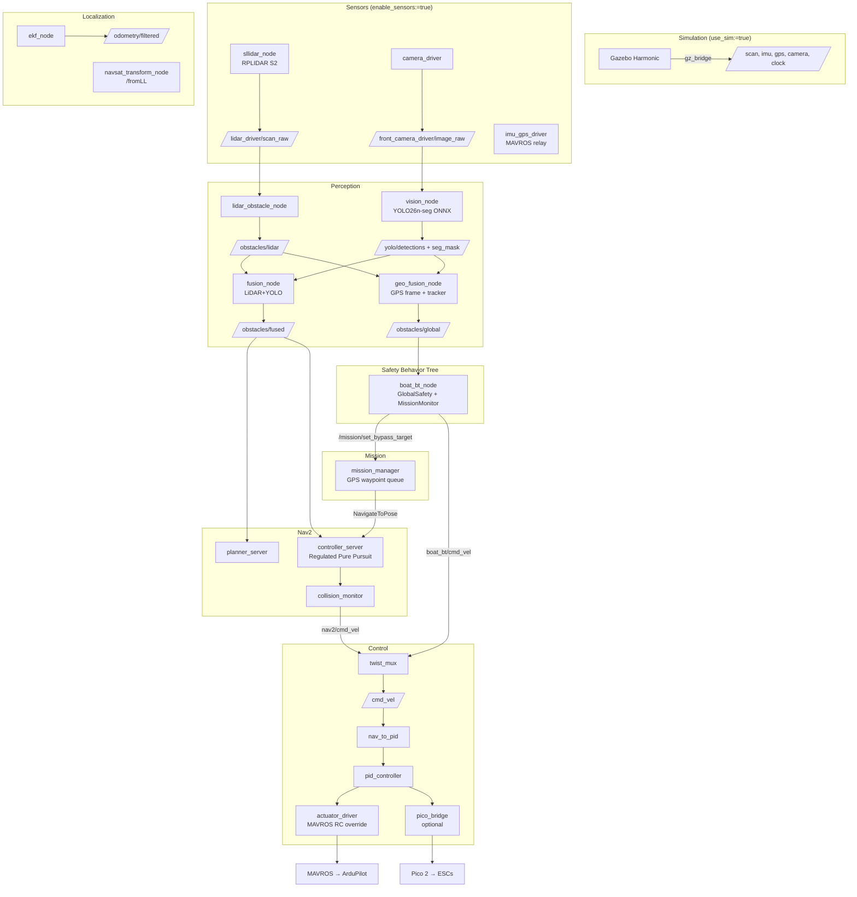

# ASKET 2.0 — Kelp Blue, Namibia

ROS 2 Jazzy autonomous surface vessel (ASV) stack for the [NODE Engineering Club](https://github.com/NODE-Engineering-Club) boat **ASKET**, adapted from the Njord 2026 competition stack for the **Kelp Blue** kelp-farm missions in Lüderitz (Shearwater Bay), Namibia, with a **Cerulean Omniscan 450 SS** side-scan sonar.

The mission design lives in [`Mission controls and documents/`](Mission%20controls%20and%20documents/):

- [`KELP_MISSIONS.md`](Mission%20controls%20and%20documents/KELP_MISSIONS.md) — the M0–M8 mission set, autonomy/decision log, telemetry and cloud design, sonar pipeline, network, phased plan.
- [`KELP_CAPABILITIES.md`](Mission%20controls%20and%20documents/KELP_CAPABILITIES.md) — component register, compatibility desk-check, power budget, bench tests T01–T18, risk register.

The outstanding work is tracked in [`TODOS.md`](TODOS.md).

## Namibia mission status

What the repo already provides for each mission in `KELP_MISSIONS.md`, and what is still to build. "Exists" means the code is here; most of it has only been bench- or sim-tested (see `TODOS.md`).

| ID | Mission | Exists in this repo | Still to build |
|---|---|---|---|
| **M0** | Harbour acceptance | Stand-test procedure (`TODOS.md`); Pico 2 e-stop/arm/mode firmware (`firmware/pico/`); BMS reader (`sensors/bms_reader`) | Go/no-go checklist wired to bench tests T01–T18; leak sensors; watchdog kill-upstream test (T15) |
| **M1** | Manual transit + link baseline | RC control through the Pico or ArduPilot; Foxglove GUI (boat LAN only) | MikroTik RSSI/rate logging; MQTT telemetry bridge to the shore station |
| **M2** | Autonomous transit + collision avoidance | `mission_manager` → Nav2 waypoint chains; `boat_bt` GlobalSafety obstacle bypass; LiDAR + camera fusion (`/obstacles/fused`, `/obstacles/global`); Nav2 `collision_monitor` (stop polygon **disabled**) | Farm-GeoJSON keep-out costmap filter + geofence check; enable/tune the stop polygon after measuring `d_stop`; Livox Mid-360S and OAK-D-LR adapters onto the existing topics; speed governor; entanglement detection |
| **M3** | Sonar survey, lane following | Lanes can already be flown as a waypoint list through `/mission/start` | Lawnmower lane generator; SonarView (Docker or BlueOS extension); `nmea_udp_bridge`; `sonar_bridge`; auto-pause on RTK/heading/ping loss |
| **M4** | Structure verification | — | Offset-pass planner around known targets; detection scoring table |
| **M5** | Repeat-pass monitoring (post-MVP) | `mission_manager` checkpoint resume (note: identical waypoint lists resume the earlier pass) | Change detection between passes |
| **M6** | Drift and deviation monitor | — | Cross-track / heading / speed-made-good monitor node and alerts |
| **M7** | Failsafe and recovery | `pid_controller` stale-setpoint hold; Pico neutral-on-silence and Ch8 ESTOP | Link-loss hold → return ladder; battery return-energy check; `actuator_driver` neutral-on-silence |
| **M8** | Post-mission offload + QA | — | MCAP recorder; integrity-checked offload; mission report |

### Where this repo differs from the Kelp documents

The two Kelp documents were written against an older public snapshot (`node-ros-2026` at commit `f61b8a3`, 6 Aug 2026). Reading this repo changes several of their findings:

| Kelp doc says | This repo | Effect |
|---|---|---|
| Pico 2 firmware is not in the repo (Missions §0.4 #6, question 17) | It is: [`firmware/pico/asket_ec_pico.ino`](firmware/pico/asket_ec_pico.ino). Ch8 LOW = ESTOP, MID = manual forced, HIGH = autonomy permitted; neutral on serial-heartbeat loss | Question 17 can be answered from the source |
| No battery telemetry code (Missions §0.4 #8) | `sensors/bms_reader` reads a BQ76920 BMS over an MCP2221 bridge → `/battery/state`, `/diagnostics` (launch arg `enable_bms`) | A starting point for the §4.1 power signals |
| 2D RPLidar, 12 m, custom driver (Missions §0.4 #7, M2 horizon table) | RPLIDAR **S2M1** via Slamtec `sllidar_ros2` (submodule), ~0.05–30 m, DenseBoost mode | The M2 detection-horizon table can use the S2's real range; measure it on water |
| Command watchdog defeated (C2) | `pid_controller` now zeroes a setpoint older than 0.5 s. It still publishes effort at 20 Hz, and `actuator_driver` has no neutral-on-silence | Partly fixed; the `actuator_driver` half of the §5.8 patch and bench test T15 still apply |
| `pid_controller` listens on `/imu/data` (C1) | Still true | Open; see `TODOS.md` |
| `collision_monitor` polygon disabled (C3) | Still true (`nav2_params.yaml`, `FootprintApproach.enabled: false`) | Open |
| `FRAME_TYPE` unconfirmed (C13) | Confirmed `FRAME_CLASS=2` (Boat), `FRAME_TYPE=0` against the real Pixhawk on 2026-08-08/09; RPP `use_rotate_to_heading: false` | Closed for the current hull; re-check if the thruster layout changes (C5) |
| GitHub token hard-coded in `scripts/init.sh` (C9) | Removed from the file on this branch; `init.sh` now requires `GHCR_TOKEN` from the environment | **The token is still in git history and must be revoked** |

## What was removed from the Njord stack

Everything specific to the Njord 2026 competition courses was removed; it remains in git history on `main` before this cleanup.

- `competition_manager` (task selection/lifecycle, `/competition/*` services and topic) and its task YAMLs
- The five competition mission sequencers: `mission_maneuvering_pathfinding`, `mission_collision_avoidance`, `mission_docking`, `mission_docking_parallel`, `mission_surprise`
- Docking perception (`dock_detector_node`, `wall_detector_node`) and their tests, and the docking Gazebo worlds
- In `boat_bt`: the docking and parallel-docking controllers, cardinal-mark passing, the Task 9.2 gate/marker-vessel COLREG logic and the Task 9.4 buoy-side logic
- `njord_msgs` interfaces used only by the above: `CompetitionState`, `DockTarget(Array)`, `WallTarget(Array)`, `SetCompetitionTask`
- Ad-hoc Trondheim test missions (`waypoints_and_detection_mission`, `send_waypoints`) and an empty `buoy_decision_node`

Names such as `njord_msgs`, `njord.launch.py`, `/opt/njord` and the `njord.service` systemd unit are kept for now so the deployed Pi and CI keep working; renaming them is tracked in `TODOS.md`.

## Getting Started

**Prerequisites (one-time install):**
1. [VSCode](https://code.visualstudio.com/)
2. [Docker Desktop](https://www.docker.com/products/docker-desktop/) — Windows / macOS. On Linux, Docker Engine or Podman works.
   - Linux/Podman: set `"dev.containers.dockerPath": "podman"` in VSCode user settings.
3. VSCode extension: [Dev Containers](https://marketplace.visualstudio.com/items?itemName=ms-vscode-remote.remote-containers)

**To start developing:**
1. Clone with submodules (the RPLIDAR S2 driver lives in `src/sllidar_ros2`): `git clone --recurse-submodules <repo-url>` (or run `git submodule update --init --recursive` in an existing clone)
2. Open this folder in VSCode
3. Click **Reopen in Container** when prompted (or `Ctrl+Shift+P` → *Dev Containers: Reopen in Container*)
4. First launch takes ~5 minutes to build. After that it's instant.

The `postCreateCommand` runs `colcon build --symlink-install` automatically and sources the workspace.

**Run the full stack (hardware):**
```bash
ros2 launch bringup njord.launch.py
```

**Run in simulation (Gazebo Harmonic):**
```bash
ros2 launch bringup njord.launch.py \
  use_sim:=true \
  enable_sensors:=false \
  enable_mavros:=false
```

This launches Gazebo with `basicWorld.sdf`, spawns the ASKET URDF, bridges the sim clock, and runs the full navigation/control/mission stack against simulated sensor topics. Add `world:=collisionAvoidanceWorld.sdf` for buoy and moving-vessel obstacles.

**Send a waypoint mission** (any list of lat/lon points, e.g. survey lanes):
```bash
ros2 service call /mission/start njord_msgs/srv/StartMission \
  "{waypoints: [{latitude: -26.6475, longitude: 15.1540, altitude: 0.0}]}"
ros2 topic echo /mission/status
ros2 service call /mission/abort std_srvs/srv/Trigger
```
`ros2 run mission north_test_mission` and `ros2 run mission random_test_mission` send a single goal offset from the current GPS fix.

**Rebuild after adding new files** (`--symlink-install` means code edits don't need a rebuild for Python packages):
```bash
colcon build --symlink-install
source install/setup.bash
```

## Launch Arguments

| Argument | Default | Description |
|---|---|---|
| `use_sim` | `false` | Enable Gazebo, sim clock, gz_bridge |
| `world` | `basicWorld.sdf` | World file under `description/worlds/` (`basicWorld.sdf`, `collisionAvoidanceWorld.sdf`) |
| `headless` | `true` | Run Gazebo server-only (`gz sim -s`). **In practice `-s` deadlocks sensor rendering even under software rendering — set `false` to actually get sensor data in a no-GPU environment.** See `TODOS.md`. |
| `enable_mavros` | `true` | MAVROS FCU bridge (ArduPilot) |
| `fcu_url` | `tcp://localhost:5777` | MAVROS FCU URL (BlueOS MAVLink router on the Pi) |
| `gcs_url` | `udp://@localhost:14556` | MAVROS GCS URL |
| `enable_localization` | `true` | EKF + NavSat transform + `datum_sync` |
| `enable_nav2` | `true` | Full Nav2 stack |
| `enable_sensors` | `true` | Camera, LiDAR, IMU/GPS drivers |
| `camera_device` | `/dev/video0` | Camera device path |
| `lidar_device` | `/dev/ttyUSB0` | LiDAR serial device path |
| `enable_perception` | `true` | LiDAR obstacle node + fusion |
| `enable_geo_fusion` | `true` | Geo-referenced fusion + tracker → `/obstacles/global` |
| `lidar_camera_extrinsic` | `""` | Path to `lidar_camera_extrinsic.yaml`; empty = use URDF nominal `lidar→front_camera` TF |
| `enable_vision` | `true` | YOLO inference node |
| `vision_confidence` | `0.5` | YOLO detection confidence threshold |
| `enable_control` | `true` | nav_to_pid, PID, actuator driver |
| `use_pico_bridge` | `false` | Drive thrusters through the Pico 2 (`pico_bridge`) instead of MAVROS RC override (`actuator_driver`) |
| `pico_port` | `/dev/ttyACM0` | Pico serial port |
| `enable_bms` | `false` | BMS reader (`sensors/bms_reader`) |
| `bms_port` | `/dev/ttyACM3` | BMS serial port |
| `enable_mission` | `true` | GPS waypoint sequencer (`mission_manager`) |
| `enable_boat_bt` | `true` | Safety Behavior Tree (`boat_bt_node`) |
| `enable_foxglove` | `true` | Foxglove WebSocket bridge (port 8765, **no authentication — boat LAN only**) |

## Workspace Layout

```
src/
├── description/    # URDF (asket.urdf.xacro), meshes, Gazebo worlds (basicWorld, collisionAvoidanceWorld)
├── sensors/        # camera_driver, imu_gps_driver, datum_sync, bms_reader
├── sllidar_ros2/   # Slamtec RPLIDAR S2 driver (git submodule)
├── perception/     # lidar_obstacle_node, fusion_node
├── fusion/         # geo_fusion_node (GPS-frame obstacles + Kalman tracker)
├── vision/         # vision_node (YOLO26n-seg ONNX inference)
├── control/        # nav_to_pid, pid_controller, actuator_driver, pico_bridge
├── mission/        # mission_manager (GPS waypoint sequencer) + test missions
├── boat_bt/        # boat_bt_node — safety Behavior Tree (BT.CPP 4)
├── njord_msgs/     # Shared interfaces (Obstacle(Array), MissionStatus, StartMission, SetBypassTarget)
├── calibration/    # scan_to_cloud, collect_data, calibrate, extrinsic_tf_publisher
├── sim/            # 2D Python simulator + sim_nav2.launch.py
├── foxglove/       # Foxglove layout + GUI helper scripts
└── bringup/        # njord.launch.py + config/
    └── config/
        ├── ekf.yaml                      # robot_localization EKF params
        ├── navsat.yaml                   # NavSat transform params
        ├── nav2_params.yaml              # Nav2 planner/controller/costmap/collision_monitor params
        ├── twist_mux.yaml                # boat_bt vs Nav2 cmd_vel arbitration
        ├── gz_bridge.yaml                # Gazebo ↔ ROS topic bridges
        ├── front_camera.yaml             # camera intrinsics (generate with calibrate_camera.launch.py)
        └── lidar_camera_extrinsic.yaml   # LiDAR→camera extrinsic (generate with calibrate_lidar_camera.launch.py)
firmware/pico/      # Pico 2 (RP2350) low-level controller: RC/SBUS, ESTOP, arming, mode authority
models/             # YOLO weights (Njord buoy/cardinal model; to be retrained for kelp canopy/buoys)
scripts/            # init.sh (Pi provisioning), deploy-pi.sh
docs/               # session notes from hardware tests
Mission controls and documents/  # Kelp Blue mission and capability design documents
```

## Architecture



The Kelp additions in `KELP_MISSIONS.md` §3–§5 (decision log, health monitor, MQTT bridge, recorder, SonarView + `sonar_bridge` + `nmea_udp_bridge`) plug into this graph; none of them exist yet.

## TF Frame Tree

The full coordinate frame tree, verified with `ros2 run tf2_tools view_frames`:

```
map
 └── odom                    (robot_localization EKF — dynamic)
      └── base_link           (robot_localization EKF — dynamic)
           ├── lidar_mount    (robot_state_publisher — static)
           │    └── lidar     ← lidar_driver frame_id
           ├── front_camera   ← camera_driver frame_id
           ├── back_camera
           ├── GPS
           └── px4            ← IMU / FCU mount
```

Static sensor transforms (published to `/tf_static` by `robot_state_publisher` from the URDF):

| Parent | Child | xyz (m) | rpy (rad) |
|---|---|---|---|
| `base_link` | `lidar_mount` | -0.103585, 0, 0.137275 | 0, 0, -π/2 |
| `lidar_mount` | `lidar` | 0, 0, 0.0375 | 0, 0, 0 |
| `base_link` | `front_camera` | 0, 0.02, 0.137275 | 0, π/2, 0 |
| `base_link` | `back_camera` | -0.62, -0.02, 0.137275 | 0, π/2, 0 |
| `base_link` | `GPS` | -0.18827, 0, 0.174775 | 0, 0, 0 |
| `base_link` | `px4` | 0, 0, 0 | 0, 0, 0 |

`odom → base_link` is published dynamically by the EKF once IMU and GPS data are available. `map → odom` is published by `navsat_transform_node`.

**Simulation-only static publishers** (conditional on `use_sim:=true`):

| Parent | Child | Purpose |
|---|---|---|
| `map` | `odom` | Identity fallback until navsat establishes GPS datum |
| `lidar` | `asket/base_link/Lidar_sensor` | Bridges Gazebo scoped sensor frame to URDF frame for collision_monitor |

## Key Topics

| Topic | Type | Direction | Description |
|---|---|---|---|
| `/lidar_driver/scan_raw` | `sensor_msgs/LaserScan` | in | LiDAR scan (hardware driver or Gazebo bridge). The contract a Livox slice should satisfy (Capabilities §5.5) |
| `/lidar_driver/cloud` | `sensor_msgs/PointCloud2` | out | LaserScan reprojected to 3D (z=0, frame `lidar`) — published by `scan_to_cloud` during calibration |
| `/front_camera_driver/image_raw` | `sensor_msgs/Image` | in | Front camera frame (BGR8 640×480). The contract an OAK-D-LR RGB stream should satisfy |
| `/front_camera_driver/image_raw/camera_info` | `sensor_msgs/CameraInfo` | out | Camera intrinsics (K, D) loaded from `front_camera.yaml` via `camera_info_manager` |
| `/imu_driver/imu_raw` | `sensor_msgs/Imu` | in | IMU data (relayed from `/mavros/imu/data`; carries UM982 GPS-yaw once ArduPilot is configured for it) |
| `/gps_driver/gps_raw` | `sensor_msgs/NavSatFix` | in | GPS fix |
| `/odom` | `nav_msgs/Odometry` | in (sim) | Gazebo ground-truth odometry (OdometryPublisher) |
| `/clock` | `rosgraph_msgs/Clock` | in (sim) | Simulation clock |
| `/yolo/detections` | `vision_msgs/Detection2DArray` | out | YOLO detections |
| `/yolo/seg_mask` | `sensor_msgs/Image` | out | Instance segmentation mask |
| `/obstacles/lidar` | `sensor_msgs/PointCloud2` | out | Raw LiDAR obstacles (frame: `lidar`) |
| `/obstacles/fused` | `sensor_msgs/PointCloud2` | out | LiDAR+YOLO fused obstacles (frame: `base_link`), feeds the Nav2 costmaps |
| `/obstacles/global` | `njord_msgs/ObstacleArray` | out | Tracked obstacles in the GPS/map frame + boat pose, consumed by `boat_bt` |
| `/odometry/filtered` | `nav_msgs/Odometry` | out | EKF-fused odometry |
| `/cmd_vel` | `geometry_msgs/Twist` | out | Final arbitrated velocity command consumed by `nav_to_pid` (hardware) and `ros_gz_bridge`/`VelocityControl` (sim). Published by `twist_mux` |
| `/nav2/cmd_vel` | `geometry_msgs/Twist` | out | Nav2's own output (`velocity_smoother` → `collision_monitor` → here). twist_mux input, priority 10 |
| `/boat_bt/cmd_vel` | `geometry_msgs/Twist` | out | `boat_bt_node`'s direct commands (stop on tree finish). twist_mux input, priority 100 |
| `/control/setpoint` | `geometry_msgs/Twist` | out | Clamped speed/yaw setpoint |
| `/control/effort` | `geometry_msgs/Twist` | out | PID output |
| `/mavros/rc/override` | `mavros_msgs/OverrideRCIn` | out | RC channels to ArduPilot |
| `/mission/start` | `njord_msgs/StartMission` (service) | in | Start a mission from a list of `GeoPoint` waypoints |
| `/mission/abort` | `std_srvs/Trigger` (service) | in | Abort the running mission |
| `/mission/status` | `njord_msgs/MissionStatus` | out | Mission state + waypoint progress (transient-local) |
| `/mission/log` | `std_msgs/String` | out | Human-readable mission trail for the GUI |
| `/mission/set_bypass_target` | `njord_msgs/SetBypassTarget` (service) | in | Temporary detour requested by `boat_bt_node` (collision risk) |
| `/battery/state` | `sensor_msgs/BatteryState` | out | BMS pack state (`enable_bms:=true`) |

## Node Reference

### `description`
- **`asket.urdf.xacro`** — Full robot URDF with root link `base_link` (hull body), propellers, LiDAR, cameras, GPS, IMU, and PX4 mount. Includes Gazebo sensor plugins (camera, GPU LiDAR, NavSat, IMU). `robot_state_publisher` reads this file and broadcasts the complete static TF tree on startup. Sensor heights do not yet match the hardware (see `TODOS.md`); the Kelp sensors (Livox, OAK-D-LR, UM982 antennas, sonar transducers) are not in it yet.
- **`worlds/basicWorld.sdf`** — Minimal Gazebo Harmonic world with Physics, UserCommands, SceneBroadcaster, Sensors (camera+lidar), IMU, and NavSat system plugins.
- **`worlds/collisionAvoidanceWorld.sdf`** — Two green/red buoy gates and a moving vessel (`otter`, driven on `/model/otter/cmd_vel`). Useful as a stand-in for demarcation buoys and service vessels when exercising GlobalSafety. Read its header comment: the sim LiDAR has a starboard blind spot.

### `sensors`
- **`camera_driver`** — OpenCV camera capture → `/front_camera_driver/image_raw` + `/front_camera_driver/image_raw/camera_info`. Starts in degraded mode if no camera connected. Loads camera intrinsics via `camera_info_manager` from the URL given by the `camera_info_url` parameter (default `package://bringup/config/front_camera.yaml`). Accepts `device` (default `/dev/video0`) and `frame_id` (default `front_camera`) parameters.
- **RPLIDAR S2M1-R2L** — driven by Slamtec's official `sllidar_ros2` (vendored as the `src/sllidar_ros2` submodule, node name `lidar_driver`), not a package in this workspace. Publishes `/lidar_driver/scan_raw` (`sensor_msgs/LaserScan`, `frame_id: lidar`, ~0.05–30 m, variable ray count set by the SDK's `DenseBoost` scan mode) — configured in `bringup/launch/njord.launch.py` (`serial_baudrate: 1000000`, topic remapped from the package's default `scan`).
- **`imu_gps_driver`** — Relays MAVROS IMU (`/mavros/imu/data` → `/imu_driver/imu_raw`) and GPS (`/mavros/global_position/raw/fix` → `/gps_driver/gps_raw`) to the unified driver topic names. Hardware only (disabled in sim).
- **`datum_sync`** — Anchors `navsat_transform_node`'s datum to the FC's home position so `/fromLL` waypoints and odom agree on the origin. Depends on `/mavros/home_position/home` (see `TODOS.md` for the Pico-only caveat).
- **`bms_reader`** — Sole owner of the BMS serial link (BQ76920 via MCP2221). Publishes `/battery/state` and per-cell detail on `/battery/status_raw` and `/diagnostics`.

### `perception`
- **`lidar_obstacle_node`** — Converts `/lidar_driver/scan_raw` → `/obstacles/lidar` (PointCloud2). Filters returns outside `minimum_obstacle_range_m`/`maximum_obstacle_range_m` (defaults 0.5–20 m) and decimates to one nearest point per `angular_decimation_deg` bin (default 1°) to bound cloud size against the RPLIDAR S2's dense native scan resolution.
- **`fusion_node`** — Fuses LiDAR point cloud with YOLO segmentation mask via TF projection. Looks up `lidar → camera_frame` in TF to project LiDAR points into the image plane; points confirmed by the segmentation mask are labeled as obstacles. Unmatched YOLO detections get a bearing estimate at 5 m. Publishes `/obstacles/fused` in `base_link` frame. Camera intrinsics update live from `/front_camera_driver/image_raw/camera_info`. Parameters: `lidar_frame` (default `lidar`), `camera_frame` (default `front_camera`, switches to `front_camera_cal` when `lidar_camera_extrinsic` launch arg is set), `camera_info_topic`.

### `fusion`
- **`geo_fusion_node`** — Associates vision detections with LiDAR clusters, lifts them into the GPS/map frame and tracks them with a constant-velocity Kalman filter. Publishes `/obstacles/global` (`njord_msgs/ObstacleArray`). See `src/fusion/README.md`.

### `vision`
- **`vision_node`** — YOLO26n-seg ONNX Runtime inference (CPU). Publishes `Detection2DArray` and an instance mask image. Confidence threshold configurable via `vision_confidence` launch arg. The current model (`models/yolo26n-seg-navier.onnx`) was trained on Njord buoys and cardinal marks (`{0: green, 1: red, 2: north, 3: east, 4: south, 5: west}`); the Kelp missions need a model for kelp canopy and farm demarcation buoys.

### `boat_bt`
- **`boat_bt_node`** — Safety Behavior Tree (BT.CPP 4, tree in `bt_xml/simple_boat.xml`). Ticks at 10 Hz once odometry (`/odometry/filtered`) is received. Structure:
  - **`GlobalSafety`** — runs on every tick. Selects the highest-risk obstacle from `/obstacles/global` (nearest, most-forward, fastest-closing within `collision_forward_sector_deg`, default ±60°, range `collision_risk_range_m`, default 20 m) and requests a detour via `/mission/set_bypass_target` (offset `collision_avoidance_offset_m`, default 12 m, cooldown `request_cooldown_sec`, default 5 s). Bypass side follows the obstacle's bearing (`+` = port → bypass starboard, `-` = starboard → bypass port; ±2° centreline deadband defaults to starboard) — a conservative reactive rule, not a COLREG/CPA classifier. A buoy-classed obstacle inside `buoy_min_standoff_m` always wins (class ids set in `njord.launch.py` for the current model). Acts only while `mission_manager` is running a mission (it is the one that executes the detour).
  - **`MissionMonitor`** — maps `/mission/status` (`SUCCEEDED/FAILED/ABORTED`) to BT `SUCCESS`/`FAILURE`, `RUNNING` otherwise. When the tree finishes it stops ticking and publishes a stop on `/boat_bt/cmd_vel`; it re-arms automatically when the next mission starts.
  - Kelp-specific subtrees (survey-line pause/hold, canopy keep-out, failsafe ladder) slot in between `GlobalSafety` and `MissionMonitor`.

### `twist_mux`
Arbitrates `/boat_bt/cmd_vel` (priority 100) and `/nav2/cmd_vel` (Nav2's own output, priority 10) into the final `/cmd_vel`. Necessary because Nav2's pipeline (`controller_server`, `behavior_server`'s recovery behaviors, `collision_monitor`'s safety-stop heartbeat) keeps publishing even with no active goal. Config: `bringup/config/twist_mux.yaml`. `use_stamped: false` — twist_mux 4.5+ defaults to `TwistStamped` for the Nav2/REP-147 migration; this stack is still plain `Twist` throughout.

### `control`
- **`nav_to_pid`** — Clamps `/cmd_vel` to safe speed (≤2 m/s) and yaw rate (≤1 rad/s), republishes as `/control/setpoint`.
- **`pid_controller`** — Dual PID (speed + yaw) driven by `/control/setpoint`, speed feedback from `/mavros/local_position/velocity_body` and yaw-rate feedback from IMU. Holds a zero setpoint when `/control/setpoint` is older than 0.5 s. Publishes `/control/effort` at 20 Hz. **Known bug:** it subscribes to `/imu/data`, which nothing publishes (see `TODOS.md`).
- **`actuator_driver`** — Maps `Twist` effort to MAVROS `OverrideRCIn` RC channels (ch1=steering, ch3=throttle, ±400 µs around 1500 µs centre).
- **`pico_bridge`** — Alternative actuation path (`use_pico_bridge:=true`): sends `L,R` motor commands and `MODE AUTO/MANUAL` to the Pico 2 over USB serial, `PING` when commands go stale (>0.3 s). The Pico firmware is in `firmware/pico/`.

### `mission`
- **`mission_manager`** — GPS waypoint queue: sequences whatever `(lat, lon)` list it's given (via `/mission/start`) through Nav2's `NavigateToPose` action, one at a time, converting each waypoint GPS → map frame via `robot_localization/FromLL` on demand. Accepts temporary detours from `boat_bt` on `/mission/set_bypass_target`. Holds at the final waypoint for `final_hold_duration_sec` (default 5 s) before reporting SUCCEEDED. Persists an on-disk checkpoint so a crash/respawn mid-mission resumes rather than restarting. This is the entry point for the Kelp transit (M2) and survey-lane (M3) missions.
- **`north_test_mission`**, **`random_test_mission`** — send one goal offset from the current GPS fix (useful for stand and sim tests).

### `calibration`
- **`scan_to_cloud`** — Converts `/lidar_driver/scan_raw` (LaserScan) → `/lidar_driver/cloud` (PointCloud2, frame `lidar`, z=0) using `laser_geometry`. Used during calibration for RViz2 visualisation.
- **`collect_data`** — Interactive two-panel OpenCV GUI: left panel = undistorted camera image, right panel = colour-coded top-down LiDAR map. Click corresponding corners in each panel, press `a` to add pair, `s` to save. Saves pairs to `~/.ros/lidar_camera_data.txt` (`x y z u v` per line).
- **`calibrate`** — Standalone PnP solver (no ROS node). Reads the data file and `front_camera.yaml`, runs `cv2.solvePnPRansac` + LM refinement, prints reprojection error, saves `~/.ros/lidar_camera_extrinsic.yaml`.
- **`extrinsic_tf_publisher`** — Reads `lidar_camera_extrinsic.yaml` and broadcasts `lidar → front_camera_cal` as a static TF. Started automatically by `njord.launch.py` when `lidar_camera_extrinsic` arg is non-empty.

### `bringup`
- **`njord.launch.py`** — Single launch file for the entire stack with per-subsystem enable flags and sim/hardware switching.
- **`ekf.yaml`** — 2D EKF fusing IMU yaw + angular velocity with odometry.
- **`navsat.yaml`** — NavSat transform configured for zero-altitude, Cartesian output, no magnetic declination.
- **`nav2_params.yaml`** — Regulated Pure Pursuit controller (`desired_linear_vel: 1.0`), NavFn planner, obstacle costmaps fed by `/obstacles/fused`, `collision_monitor` (stop polygon disabled).

### `foxglove`
Foxglove Studio layout and helper scripts. See [`src/foxglove/README.md`](src/foxglove/README.md), including which parts of the Kelp navigation-monitor screen (Missions §4.7) are still missing.

## Simulation Details

Gazebo Harmonic (Sim 8) integration via `ros_gz_bridge` and `ros_gz_sim`:

- World name: `default` (in `basicWorld.sdf` and `collisionAvoidanceWorld.sdf`)
- GPS datum: Lüderitz, Namibia (approx. 26.648°S, 15.154°E) set via `<spherical_coordinates>` in the world SDF — Gazebo NavSat outputs coordinates relative to this origin. It was Trondheim for Njord; replace it with the surveyed F9P base point once known. The 2D Python simulator (`sim` package) keeps its own Barcelona origin in `simulator.py` for the October Barcelona water tests.
- Robot spawned via `ros2 run ros_gz_sim create -file asket.urdf -world default` with a 5 s delay to let Gazebo load
- Clock bridged: `gz.msgs.Clock` → `/clock` (`rosgraph_msgs/Clock`)
- Sensor topics published by Gazebo directly to their driver topic names (e.g. `/lidar_driver/scan_raw`, `/imu_driver/imu_raw`)

**Sensor plugins active in sim:**

| Sensor | Gazebo plugin | Topic |
|---|---|---|
| GPU LiDAR | `gz-sim-sensors-system` | `/lidar_driver/scan_raw` |
| Front camera | `gz-sim-sensors-system` | `/front_camera_driver/image_raw` |
| Back camera | `gz-sim-sensors-system` | `/back_camera_driver/image_raw` |
| IMU | `gz-sim-imu-system` | `/imu_driver/imu_raw` |
| GPS/NavSat | `gz-sim-navsat-system` | `/gps_driver/gps_raw` |

**Gazebo model plugins (in `asket.urdf.xacro`):**

| Plugin | Purpose |
|---|---|
| `gz::sim::systems::OdometryPublisher` | Ground-truth odometry → `/model/asket/odometry` (bridged to `/odom`). Breaks the EKF↔navsat circular dependency by giving EKF a bootstrap odometry source. |
| `gz::sim::systems::VelocityControl` | Applies Nav2 `/cmd_vel` Twist directly to the model body. Appropriate for USV where thruster dynamics are not simulated. |

**Verified working (as of 2026-05-17, with the Trondheim datum — not yet re-run with the Lüderitz datum):**
- Full TF chain `map → odom → base_link` established at startup
- All Nav2 lifecycle nodes (controller, planner, bt_navigator, collision_monitor, etc.) activate cleanly
- GPS waypoint conversion via `/fromLL` returns correct map-frame coordinates
- `navigate_to_pose` goals accepted and executed; WP1 `Goal succeeded` confirmed
- Robot physically moves in Gazebo via VelocityControl plugin

## Camera Calibration

Camera intrinsics are required for accurate LiDAR-camera projection in `fusion_node`. Calibration must be performed once on the vehicle with the physical camera and a printed checkerboard.

**Prerequisites:** Print a 7×9 interior-corner checkerboard with 20 mm squares ([generate one at calib.io](https://calib.io/pages/camera-calibration-pattern-generator)).

**Run the calibrator** (camera must be connected):

*Dev container:*
```bash
ros2 launch bringup calibrate_camera.launch.py
# Optional overrides:
#   camera_device:=/dev/video1   (if camera is not at /dev/video0)
#   size:=6x8                    (if using a different board)
#   square:=0.025                (if squares are 25 mm)
```

*On the Pi (containerized) — mount the config directory so COMMIT writes the YAML directly to the repo:*
```bash
xhost +local:
sudo podman run --rm --name njord-cal \
  --privileged \
  --network host \
  --ipc host \
  --pid host \
  --device /dev/video0 \
  -e DISPLAY=$DISPLAY \
  -v /tmp/.X11-unix:/tmp/.X11-unix \
  -v $(pwd)/src/bringup/config:/root/.ros/camera_info \
  node-ros-2026:calibration \
  bash -c "ros2 launch bringup calibrate_camera.launch.py"
```

The GUI opens automatically. Move the checkerboard around — vary tilt, distance, and position — until all four progress bars (X/Y/Size/Skew) go green. Click **CALIBRATE** → **SAVE** → **COMMIT**.

**Save the result:**

*Dev container:* copy the file from the default camera_info location:
```bash
cp ~/.ros/camera_info/front_camera.yaml src/bringup/config/front_camera.yaml
```

*On the Pi:* the volume mount above writes `front_camera.yaml` directly to `src/bringup/config/` — no copy needed.

Commit the YAML to git and rebuild the image so it is baked into the next deployment.

Rebuild locally so the YAML is picked up by `package://bringup/...`:
```bash
colcon build --symlink-install --packages-select bringup
source install/setup.bash
```

**Verify:**
```bash
ros2 topic echo /front_camera_driver/image_raw/camera_info --once
# K[0] and K[4] should be non-zero focal lengths from your calibration
```

The calibration file is loaded by `camera_driver` via `camera_info_manager` and the intrinsics are forwarded to `fusion_node` over the `/front_camera_driver/image_raw/camera_info` topic at startup.

**Verified working (as of 2026-07-08):** Full CALIBRATE → SAVE → COMMIT flow completed on hardware via the containerized workflow above; `front_camera.yaml` committed to the repo with real intrinsics from the front camera (fx=700.2, fy=696.5, cx=294.6, cy=226.6).

## Camera–LiDAR Extrinsic Calibration

Extrinsic calibration finds the precise rigid-body transform from the LiDAR frame to the camera frame, correcting the nominal URDF values. Uses the [TurtleZhong point-correspondence method](https://github.com/TurtleZhong/camera_lidar_calibration) adapted for ROS2: manually pick matching corners in the camera image and LiDAR scan, then solve with `cv2.solvePnP`.

**Prerequisites:** Camera intrinsic calibration must be complete (`front_camera.yaml` must exist in `bringup/config/`).

**Physical setup:**
- Use a flat board (≥ 40 cm wide) mounted vertically on a stand.
- `base_link` is the hull. The LiDAR scan plane is ~52.5 mm above the hull; the camera lens is ~24.5 mm above the hull. Position the board so its horizontal midline is at LiDAR scan height (~52.5 mm above hull).

**Step 1 — Collect point pairs** (both sensors must be connected):
```bash
ros2 launch bringup calibrate_lidar_camera.launch.py
```
Two OpenCV windows open — camera image (left) and top-down LiDAR map (right). The
camera panel also overlays a magenta guide showing roughly where the LiDAR scan
plane should cross the image, projected from the nominal (uncalibrated)
`base_link→lidar`/`front_camera` TF — useful for lining up clicks vertically, but
not calibrated itself, so don't trust it horizontally.
- Press **`f`** to freeze frames
- Click the **same physical corner** in both windows
- Press **`a`** to add the pair
- Repeat for ≥ 6 corners across ≥ 3 different board positions/angles — collecting
  more than the minimum (10–15 pairs) gives RANSAC room to filter out noisy clicks
- Press **`s`** to save → `~/.ros/lidar_camera_data.txt`

**Step 2 — Solve:**
```bash
ros2 run calibration calibrate
# Prints reprojection error — aim for < 5 px
```

**Step 3 — Apply:**
```bash
cp ~/.ros/lidar_camera_extrinsic.yaml src/bringup/config/lidar_camera_extrinsic.yaml
# Commit to git, then launch with:
ros2 launch bringup njord.launch.py \
  lidar_camera_extrinsic:=$(pwd)/src/bringup/config/lidar_camera_extrinsic.yaml
```

When `lidar_camera_extrinsic` is set, `njord.launch.py` publishes a `lidar → front_camera_cal` static TF and `fusion_node` automatically uses it instead of the URDF-derived `front_camera` frame. Without the argument the stack behaves exactly as before.

**Verify alignment in RViz2:**
```bash
ros2 run rviz2 rviz2
# Add: Image (/front_camera_driver/image_raw) + PointCloud2 (/lidar_driver/cloud, fixed frame: front_camera_cal)
# LiDAR points should project onto visible surfaces in the image
```

**Verified working (as of 2026-07-14):** Full collect → solve → apply flow completed
on hardware — `lidar_camera_extrinsic.yaml` committed with 2.51 px mean reprojection
error (7/12 RANSAC inliers). Not yet visually re-verified in RViz2 per the step
above; see `TODOS.md`.

**References:**

> [1] L. Zhang, X. Xu, J. He, K. Zhu, M. Luo, and Z. Tan, "Calibration Method of 2D LIDAR and Camera Based on Indoor Structural Features," Hohai University. Available: <https://www.researching.cn/articles/OJbfdef44a334f8d3f>

> [2] Q. Zhang and R. Pless, "Extrinsic calibration of a camera and laser range finder (improves camera calibration)," in *2004 IEEE/RSJ International Conference on Intelligent Robots and Systems (IROS)*, vol. 3, Sept. 2004, pp. 2301–2306.

> [3] X. Zhong, *camera_lidar_calibration: A tool used to calibrate the extrinsic between a 2D laser range finder (LRF) and camera*, GitHub, 2018. Available: <https://github.com/TurtleZhong/camera_lidar_calibration>

## Debugging

Run only the subsystems you care about:

```bash
# Vision only — no hardware required
ros2 launch bringup njord.launch.py \
  enable_mavros:=false \
  enable_localization:=false \
  enable_nav2:=false \
  enable_control:=false \
  enable_mission:=false \
  enable_perception:=false

# Perception pipeline only
ros2 launch bringup njord.launch.py \
  enable_mavros:=false \
  enable_localization:=false \
  enable_nav2:=false \
  enable_control:=false \
  enable_mission:=false
```

Useful commands:

```bash
ros2 topic list                              # see all active topics
ros2 topic hz /lidar_driver/scan_raw         # ~10 Hz from driver or sim
ros2 topic hz /obstacles/lidar               # ~10 Hz from lidar_obstacle_node
ros2 topic hz /obstacles/fused               # ~10 Hz from fusion_node
ros2 topic hz /odometry/filtered             # ~30 Hz from EKF
ros2 topic hz /odom                          # ~30 Hz (sim only, Gazebo OdometryPublisher)
ros2 topic echo /yolo/detections             # stream YOLO detections
ros2 topic echo /gps_driver/gps_raw --once  # verify GPS datum (~26.65°S, ~15.15°E in Gazebo sim)
ros2 run tf2_tools view_frames               # render full TF tree to PDF
ros2 node list                               # confirm all nodes are running
```

**Sensor processing test commands (sim mode):**

```bash
# Launch sim with perception but no vision (YOLO not needed for basic lidar test)
ros2 launch bringup njord.launch.py use_sim:=true enable_vision:=false

# After ~10 s:
ros2 topic hz /lidar_driver/scan_raw     # expect ~15 Hz (Gazebo GPU lidar)
ros2 topic hz /obstacles/lidar           # expect ~15 Hz (passthrough from lidar_obstacle_node)
ros2 topic hz /obstacles/fused           # expect ~10 Hz (fusion timer, lidar-only mode)
ros2 topic echo /obstacles/lidar --once  # verify width > 0 (points detected)
```

## Running a mission on the real boat (SSH from another laptop)

The onboard computer runs `njord.service` (installed by `scripts/init.sh`, see Production Deploy below), a systemd unit that keeps a Podman container named `njord` running the full stack — `ros2 launch bringup njord.launch.py` with **default args**, so `enable_control:=true` (real thrusters live) but no mission starts until one is sent. To run a mission, SSH in and call `/mission/start` inside the running container:

```bash
# From your laptop:
ssh pi@boat.local
# (or the boat's IP if mDNS/.local resolution isn't working on your network)

# On the boat — confirm the stack is actually up first:
systemctl status njord.service
podman ps   # expect a container named "njord"

# Send a waypoint mission inside the running container.
podman exec -it njord bash -c \
  "source /opt/ros/jazzy/setup.bash && source /opt/njord/setup.bash && \
   ros2 service call /mission/start njord_msgs/srv/StartMission \
   '{waypoints: [{latitude: <lat>, longitude: <lon>, altitude: 0.0}]}'"
```

**Before running any of this for real: the thrusters are live.** Boat secured (on a stand or in the water with the area clear), a human present the whole time, and you know how to cut power or hit the kill switch (Pico Ch8 LOW = ESTOP) — same stand-test discipline as `TODOS.md`'s pre-water checklist and the M0 checks in `KELP_MISSIONS.md`.

Useful commands from a second SSH session while a mission runs (the host itself has no ROS install — `ros2` commands must run inside the container):

```bash
podman logs -f njord                                        # main stack's logs, from the bare host
podman exec -it njord bash -c \
  "source /opt/ros/jazzy/setup.bash && source /opt/njord/setup.bash && \
   ros2 topic echo /mission/status"                          # runs inside the container
podman exec -it njord bash -c \
  "source /opt/ros/jazzy/setup.bash && source /opt/njord/setup.bash && \
   ros2 service call /mission/abort std_srvs/srv/Trigger"    # abort the mission
sudo systemctl restart njord.service   # full stack restart — bare host
podman stop njord                      # hard stop — kills the whole stack, thrusters included — bare host
```

## Production Deploy

```bash
bash scripts/deploy-pi.sh
```

SSHes into `pi@boat.local`, pulls the latest image from GHCR, sets up systemd services for BlueOS and the stack, and reboots. First-time provisioning of a new Pi uses `scripts/init.sh`, which needs a GitHub token with `read:packages` passed in the environment:

```bash
sudo GHCR_TOKEN=<pat> bash scripts/init.sh
```

Never commit the token. The onboard computer for Namibia (Raspberry Pi + BlueOS as here, or a Jetson AGX Orin) is still an open decision, see `KELP_CAPABILITIES.md` §0.5.
